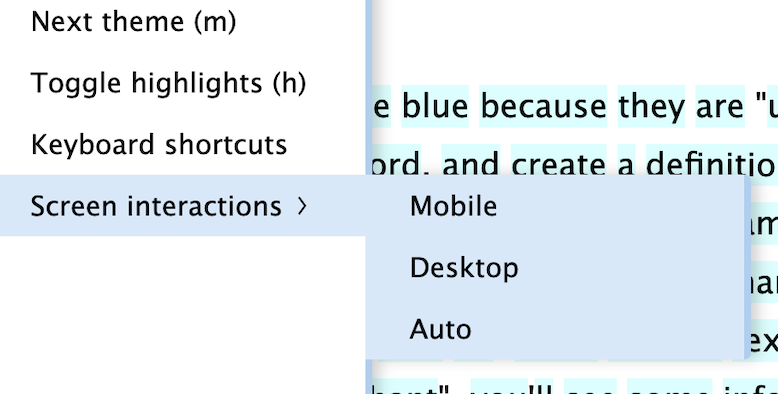

# I can't click on words in the reading screen

Though Lute was developed primarily for desktop use, some users connect to Lute on their mobile devices (see [Mobile support](../setup/mobile-support.md) and [Reading on mobile](http://localhost:3000/usage/reading-on-mobile.html)).  Lute tries to set up a desktop or mobile environment automatically, but sometimes it's hard to determine if you're on mobile or not[^1].  Sometimes it's not even possible: for example, you may have a regular laptop with an additional external touchscreen ...

If your reading screen isn't responding to clicks or touches, you may need to tell Lute what kinds of screen interactions you need.  In the slideout menu of the reading menu, you can do that:

[^1] See [StackOverflow](https://stackoverflow.com/questions/72502079/how-can-i-check-if-the-device-which-is-using-my-website-is-a-mobile-user-or-no) for the definition of futility.