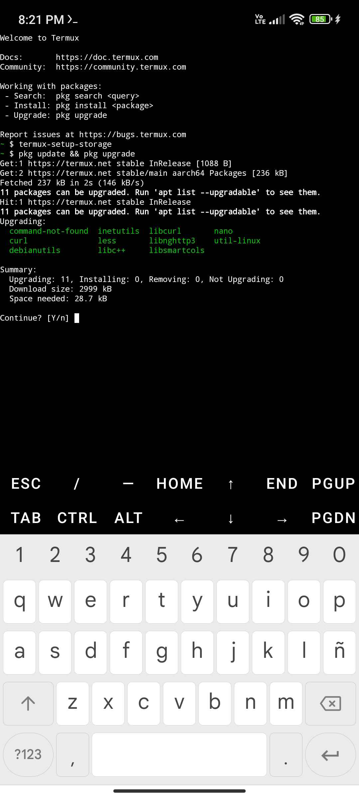
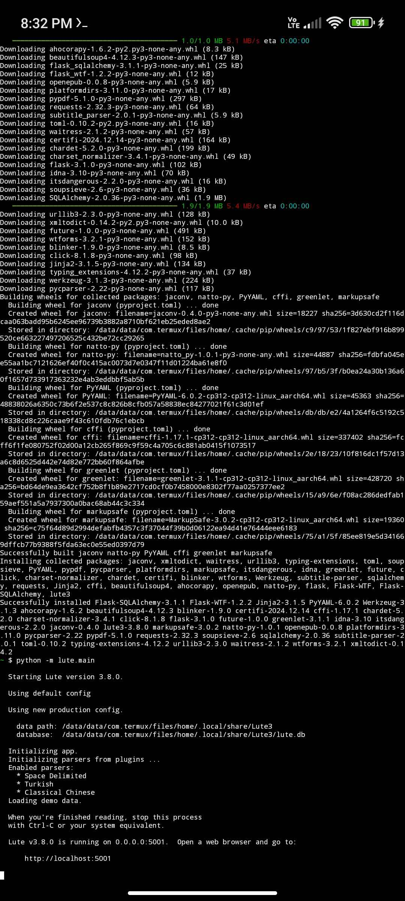
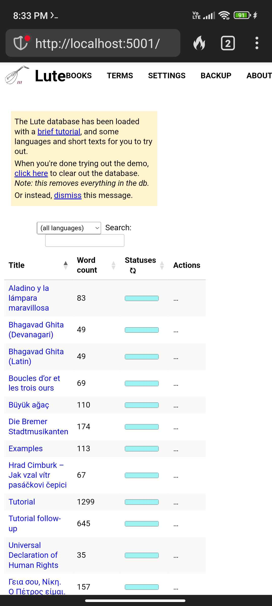
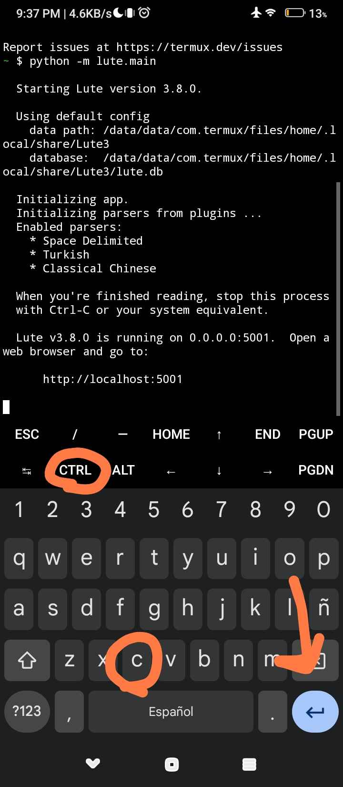

# Installing on Android using Termux

(Thanks **very much** to Discord user `@axmanalex`!)

> Note: these instructions are to install a standalone Lute running on your phone.  If you want to use your phone to connect to a version of Lute running on your computer, you may need to try a different setup ... see [the faq](../faq/setup/mobile-support.md).

Termux[^1] is a Linux command line emulator app for Android.  Using Termux, you can run Python (and Lute) on your Android phone.

First, install the Termux app on your phone following the instructions on the official Termux GitHub repository, [https://github.com/termux/termux-app](https://github.com/termux/termux-app).

At the command prompt, enter the following command to grant storage permissions.

```
termux-setup-storage
```

Update some libraries to install Lute:

```
pkg update && pkg upgrade
```



(always hit "Y" to continue)

Then enter the following commands as shown to install python and Lute, and then to start Lute itself:

```
pkg install python3
pip install --upgrade lute3
python -m lute.main
```



The message shows `Lute vX.Y.Z is running on 0.0.0.0:5001`.  Open your browser and go to `http://localhost:5001/`, and you should see it:



## Stopping Lute

To stop Lute from running, open your keyboard and tap CTRL + C:



## Uninstalling Lute

To uninstall Lute, uninstall the Termux app

---

[^1] Per https://termux.dev/en/: "Termux is an Android terminal emulator and Linux environment app that works directly with no rooting or setup required. A minimal base system is installed automatically - additional packages are available using the APT package manager."
