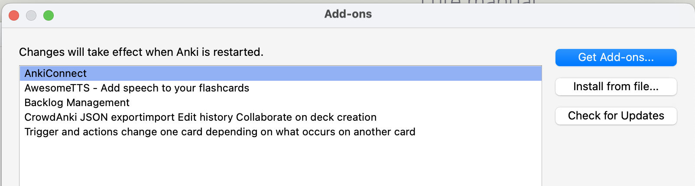
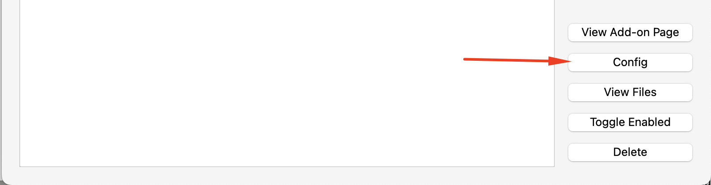
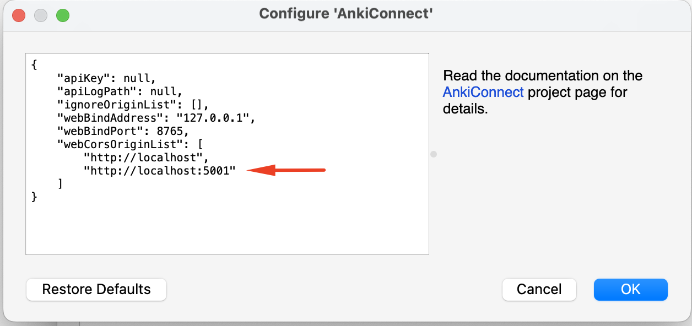

# Anki and AnkiConnect

## Anki

In a nutshell, Anki is flashcard software.

There's a lot more to it than that, of course.  There is a lot of documentation out there about Anki, it's worth becoming familiar with.  [The Anki user manual](https://docs.ankiweb.net/) is very good, and a search like "Anki introduction" in YouTube returns many videos, like [this one](https://www.youtube.com/watch?v=ixD9RWpFuk4). 

For usage with Lute, you only need to be familiar with a few terms, all covered in the "Key Concepts" of the [Anki manual](https://docs.ankiweb.net/getting-started.html):

- [Decks](https://docs.ankiweb.net/getting-started.html#decks): "A deck is a group of cards"
- [Note types](https://docs.ankiweb.net/getting-started.html#note-types): "Anki allows you to create different types of notes for different material. Each type of note has its own set of fields and card types."

You export your Lute terms to different "Note types", and you can define multiple "cards types" for each note type.

(Note: I can't give any real support or guidance regarding Anki, as it's such a big topic.)

## AnkiConnect - installing and configuring

[AnkiConnect](https://ankiweb.net/shared/info/2055492159) is an Anki add-on that lets Lute communicate with Anki.  You have to configure it once installed.  Here's a quick guide:

1. Open Anki desktop.  In the menu, click "Tools > Add-ons", then click "Get Add-ons".
2. Paste the AnkiConnect add-on code from the [AnkiConnect add-on page](https://ankiweb.net/shared/info/2055492159).
3. Restart Anki
4. To configure AnkiConnect, in the menu, click "Tools > Add-ons", then click on AnkiConnect and Config:

In the AnkiConnect configuration, you have to specify your Lute URL and port in the "webCorsOriginList".  For example, for my Lute instance running on `http://localhost:5001/`, I have the following:

**You _must_ restart Anki for the configuration change to take effect!**
