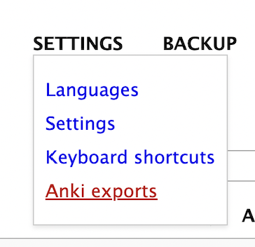
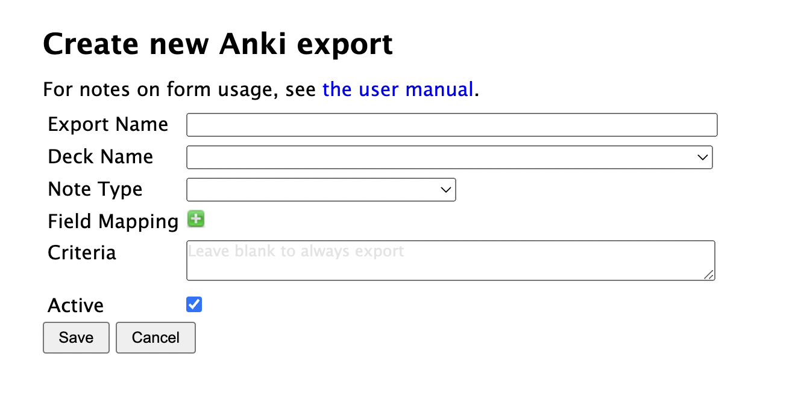
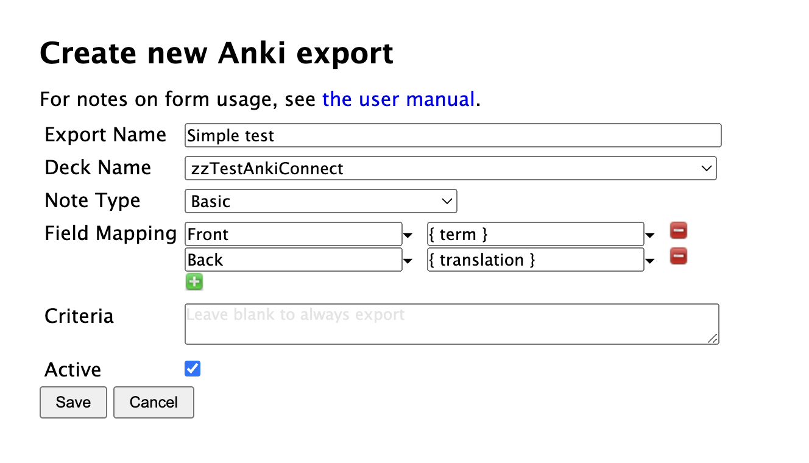

# Defining exports

Once Anki and AnkiConnect are setup, and the connection verified, you can create export specifications from Settings > Anki exports:

Then click the "Create new export specification" at the bottom of the listing.

| Field | Notes |
| --- | --- |
| Export name | Whatever you want to call this export |
| Deck Name | The target deck where new notes will be added.  You need to create the deck first. |
| Note Type | The Anki "note type" that terms will be exported to.  The note type must already exist in Anki.  You can use Anki's built-in note types or create your own.  When you select the Note Type, all of the fields on the note are added to the Field Mapping, with blank values. |
| Field Mapping | How to map data from Lute to the Anki note.  See [Field mappings](./field-mappings.md) |
| Criteria | (Optional) Criteria that a Lute term must satisfy for it to be exported.  See [Criteria](./criteria.md) |
| Active? | True if this export should be used. |

## The simplest export possible

The simplest export would be one to any deck, using the Basic card, with some simple mappings and no criteria:

## Suggestions

Exports can take some time and thought to define!  Some suggestions from my experience:

* when you're first testing exports, perhaps create a deck like "testing_exports", and use that as the destination deck in your exports.  You can delete the cards in this test deck as go, until you have the mappings you want.
* you might want to create separate "Lute decks" for your exports, to keep Lute export data separate from your other data.
