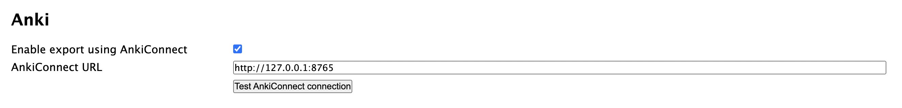
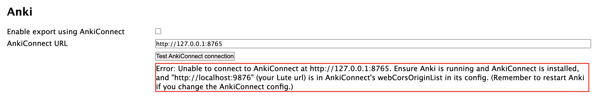

# Enabling exports

Go to Settings > Settings and scroll down to enable Anki exports and configure your AnkiConnect URL:

**Test the connection!**  If it fails, you'll get a message as shown below:

