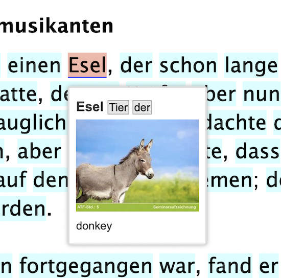
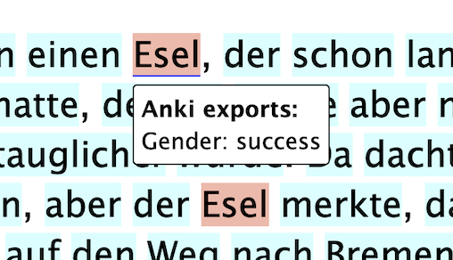

# Exporting terms

Once Anki and AnkiConnect are set up, and your exports configured, you can export terms from Lute.

(Anki and Anki connect must be running for the export to work, of course :-P)

## From the reading screen

When reading, you can hover over a word, or shift click multiple words ...

... and then export them using the reading menu.  You can also define a keyboard shortcut for the Anki export if you want.

You can hover over these messages to remove them, or hit Escape or reload the page.

When you export from the reading screen, the `{ sentence }` field mapping value is the sentence the term is found in on the reading screen.

## From the term listing

From the listing, click the checkmarks for the terms you want to export, and in the actions menu click export to Anki.
