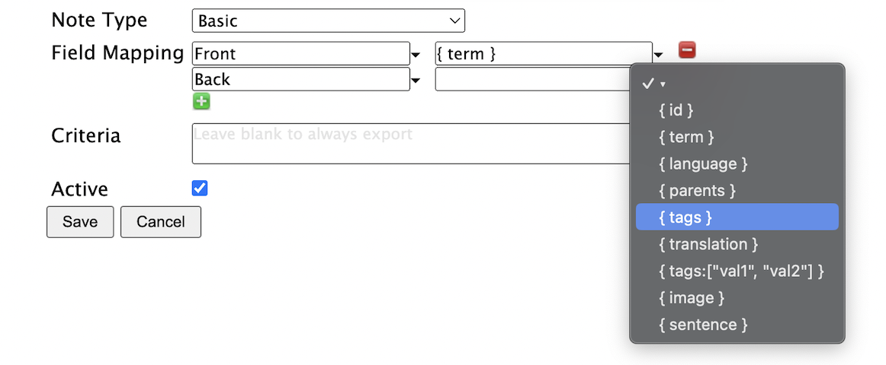

# Field mappings

Once you have selected an export Note type, you can then specify how data should be exported from Lute to Anki.

For example, here I'm defining an export to an Anki "Basic" note, one of Anki's built-in note types:

As shown, the term will be mapped to the Front field using `{ term }`, and I'm selecting another value for the Back field.

## Allowed options

Allowable options are given in the value drop-down menu.

| Mapping | Description | Example |
| --- | --- | --- |
| `{ id }` | The term ID in Lute (may be useful for creating links back to Lute from your Anki card) | 42 |
| `{ term }` | The term text | Bücher |
| `{ language }` | The term language | German |
| `{ parents }` | All term parents | Buch |
| `{ tags }` | All tags | plural |
| `{ translation }` | The translation of the parent term, if any, and the term itself | Book |
| `{ pronunciation }` | The pronunciation | Boo-cher |
| `{ tags:["val1", "val2"] }` | A filtered list of tags in the term and its parents matching the given values | |
| `{ image }` | The term image, if available | |
| `{ sentence }` | If exporting the term from the reading screen, this is the sentence that the term was in.  If exporting from the term listing, this is the latest reference associated with the term (as shown in the Sentences tab on the term form). | Ich habe die Bücher. |

* The values in the curly braces (e.g., `id`, `term`, etc`) are fixed, you can't make up your own mappings.
* You can add extra text in the mapping if you want, for example, you could export "___ { term }" to get "___ Buch".

## Filtered tags (e.g. `{ tags: ["der", "die", "das"] }`)

Filtering the tags can be useful if your terms have many tags.  For example, in my German terms, the term "Baum" is tagged with "der" (because it's masculine), and "Pflanze" (because it's a type of plant).  With the field mapping `{ tags: ["der", "die", "das"] }` Lute will only output "der", and not include "Pflanze", which is useful for creating an Anki card to test Genders.

**Important notes**

- In Anki, **the first field of your note must not be blank, and must be unique.**  If you define multiple exports to the same deck with the same first field value, they will be rejected.
- If you change the name of your Anki decks or field names, you'll need to update your export definitions in Lute.  Exports will fail with descriptive messages.
