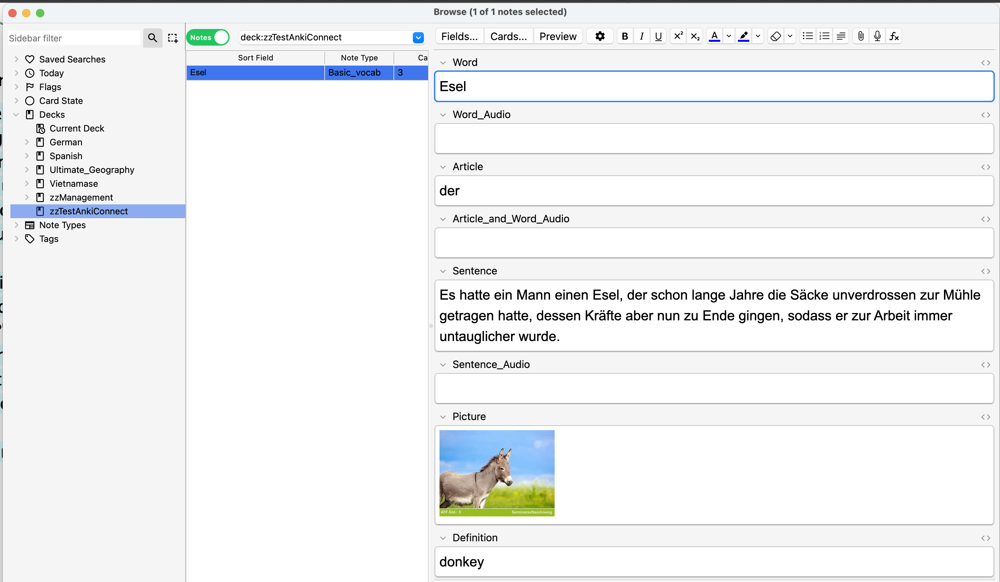
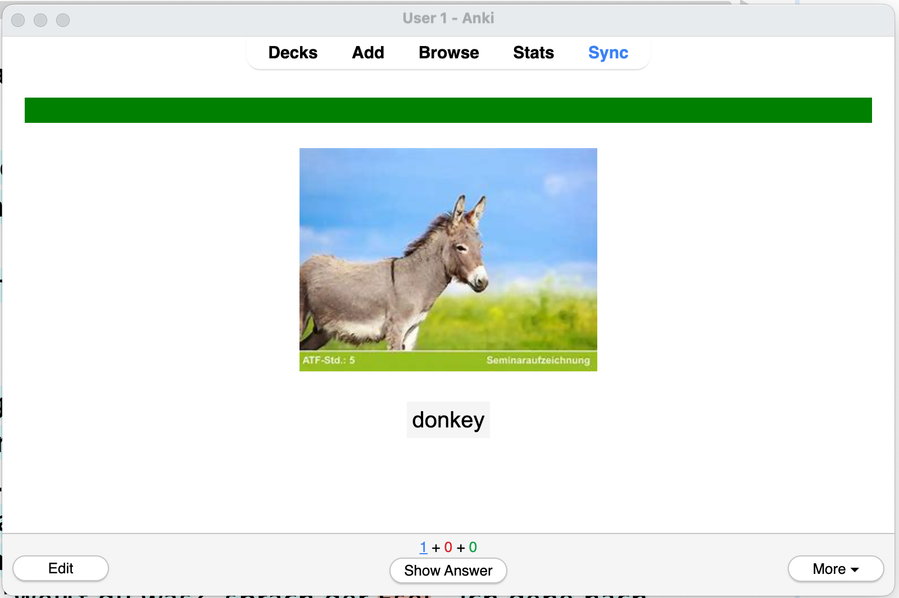
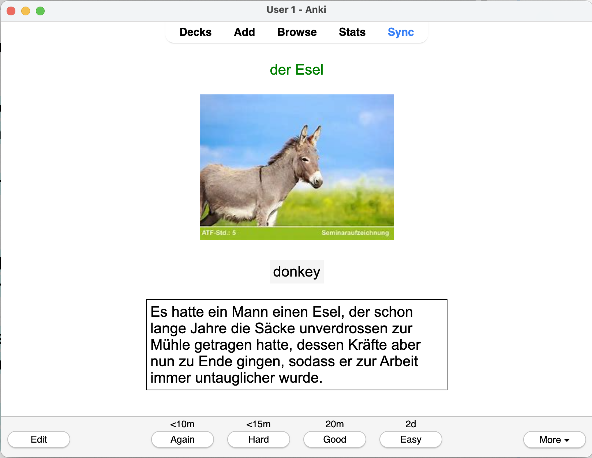

# Overview

Lute doesn’t have built-in flashcards for various reasons[^1], so it provides a way to export terms to [Anki](https://apps.ankiweb.net/), a popular and free flashcard program.

In summary:

1. You install Anki desktop and the AnkiConnect add-on (see LINK HERE)
2. You define how Lute should export terms
3. You export selected terms from the term listing or while reading.

> Anki exports will only work on a machine that has Anki desktop and AnkiConnect installed. It doesn’t work from a mobile device.

## A quick sample

After telling Lute how to export data, from the reading screen, you can hover over a term:

and hit a hotkey you define:

The data is exported to Anki per your export specification (deck and field mappings):

and Anki handles the flashcard generation and scheduling, according to how you've set it up, e.g.:

| Front | Back |
| --- | --- |
|  |  |

## A disclaimer :-)

Anki exports are tricky to handle it a general way:

- Usually, language data is fairly unstructured.
- Many users will have different needs.
- Different kinds of terms will require different kinds of Anki cards (for example, cards to test gender, verb tenses, etc.)

There's no simple way to do _perfect_ exports in a general way, and some things might not be possible at all, without custom code!

Given the above, it might be best to look at Lute's Anki exports as a "first draft" for some Anki cards, which you can further refine, suspend, or delete as needed.  From my experience, the cards are usually just fine, and I can make any other cards outside of Lute as usual.

[^1]: these reasons are given in the [FAQ](https://luteorg.github.io/lute-faqs/why-no-flashcards.html) -- basically, it's a ton of work!
