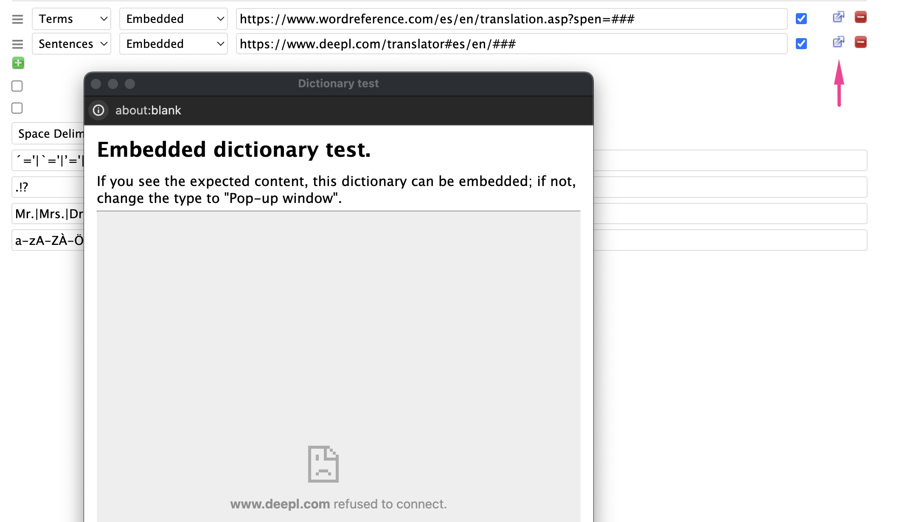

# Dictionaries

You can add multiple dictionaries for Term and Sentence lookups as part of your Language definition.

Term dictionaries are shown as tabs in the term form.

Sentence dictionaries are used during sentence translation, when you hover over a term and hit the `t` hotkey.  If you have multiple Sentence dictionaries, you can cycle through them by repeatedly hitting `t` (or `Shift + t` for the paragraph).

## Embedded or Popup

Dictionaries can either be configured to be "Embedded" or "Pop-up".

Some sites, like DeepL and Google Translate, don't work when embedded within sites.  These sites have to be viewed in separate pop-up windows, outside of Lute itself.
  
You can test a dictionary by clicking the small "out arrow" icon next to the dictionary.  For example, here I've tried to set DeepL.com as an embedded dictionary, which they don't allow:

## The dictionary URL

The dictionary link entry on the form can contain `[LUTE]` (or `###`, though the former is preferred).  Lute substitutes that with the actual term you're looking up.

Some dictionaries don't take parameters at all, so the placeholder is optional.  For example, `https://www.cherokeedictionary.net/###` gives an error.  In these cases, don't use a parameter, e.g. `https://www.cherokeedictionary.net`.

## Sample dictionaries

Below are the dictionaries for the languages that come pre-configured with Lute:

|Language|For|Type|URL|
|---|---|---|---|
|Afrikaans|sentences|popup|`https://translate.google.com/?hl=en&sl=af&tl=en&text=[LUTE]&op=translate`|
|Afrikaans|terms|embedded|`https://af.wiktionary.org/wiki/[LUTE]#Afrikaans_(af)`|
|Afrikaans|terms|embedded|`https://en.wiktionary.org/wiki/[LUTE]#Afrikaans`|
|Afrikaans|terms|embedded|`https://www.verbix.com/webverbix/go.php?&D1=67&T1=[LUTE]`|
|Afrikaans|terms|popup|`https://en.glosbe.com/af/en/[LUTE]`|
|Ainu|sentences|embedded|`https://tatoeba.org/en/sentences/search?from=ain&query=[LUTE]&to=eng`|
|Ainu|terms|embedded|`https://en.wiktionary.org/wiki/[LUTE]#Ainu`|
|Ainu|terms|popup|`https://ainu.ninjal.ac.jp/topic/dictionary/en`|
|Ainu|terms|popup|`https://ainugo.nam.go.jp/search/word?word=[LUTE]&typeDict=on&person=&matCd=&minLineCd=&maxLineCd=`|
|Ainu|terms|popup|`https://tatoeba.org/en/sentences/search?from=ain&query=[LUTE]&to=eng`|
|Albanian|sentences|popup|`https://translate.google.com/?sl=sq&tl=en&text=[LUTE]&op=translate`|
|Albanian|terms|embedded|`https://en.wiktionary.org/wiki/[LUTE]#Albanian`|
|Albanian|terms|embedded|`https://sq.wiktionary.org/wiki/[LUTE]`|
|Albanian|terms|embedded|`https://www.verbix.com/webverbix/go.php?&D1=103&T1=[LUTE]`|
|Albanian|terms|popup|`https://en.glosbe.com/sq/en/[LUTE]`|
|Amharic|sentences|popup|`https://translate.google.com/?sl=am&tl=en&text=[LUTE]&op=translate`|
|Amharic|terms|embedded|`http://www.amharicdictionary.com/Home/Index/[LUTE]`|
|Amharic|terms|embedded|`https://www.amharicpro.com/index.php?dr=101&searchkey=[LUTE]`|
|Amharic|terms|embedded|`https://www.verbix.com/webverbix/go.php?&D1=252&T1=[LUTE]`|
|Amharic|terms|popup|`https://dictionary.abyssinica.com/[LUTE]`|
|Arabic|sentences|popup|`https://translate.google.com/?hl=en&sl=ar&tl=en&text=[LUTE]`|
|Arabic|sentences|popup|`https://www.deepl.com/translator#ar/en/[LUTE]`|
|Arabic|terms|embedded|`https://context.reverso.net/translation/arabic-english/[LUTE]`|
|Arabic|terms|embedded|`https://en.wiktionary.org/w/index.php?search=[LUTE]#Arabic`|
|Arabic|terms|embedded|`https://www.arabicstudentsdictionary.com/search?q=[LUTE]`|
|Arabic|terms|popup|`https://translate.google.com/?hl=en&sl=ar&tl=en&text=[LUTE]&op=translate`|
|Arabic|terms|popup|`https://www.deepl.com/translator#ar/en/[LUTE]`|
|Arabic|terms|popup|`https://www.livingarabic.com/en/search?q=[LUTE]&dc[]=1&dc[]=8&dc[]=3&dc[]=2&dc[]=4&dc[]=6&dc[]=5&dc[]=10&dc[]=9&st[]=0&st[]=1&st[]=2`|
|Armenian|sentences|popup|`https://translate.google.com/?sl=hy&tl=en&text=[LUTE]&op=translate`|
|Armenian|terms|embedded|`http://www.nayiri.com/search?dt=HY_HY&r=0&l=en&query=[LUTE]`|
|Armenian|terms|embedded|`http://www.nayiri.com/search?l=en&dt=HY_EN&r=0&query=[LUTE]`|
|Armenian|terms|embedded|`https://calfa.fr/search?query=[LUTE]`|
|Armenian|terms|embedded|`https://en.wiktionary.org/wiki/[LUTE]#Armenian`|
|Armenian|terms|embedded|`https://www.verbix.com/webverbix/go.php?&D1=135&T1=[LUTE]`|
|Azerbaijani|sentences|embedded|`https://www.bing.com/translator/?from=hy&to=en&text=[LUTE]`|
|Azerbaijani|sentences|popup|`https://translate.google.com/?sl=gd&tl=en&text=[LUTE]&op=translate`|
|Azerbaijani|sentences|popup|`https://translate.yandex.com/?source_lang=az&target_lang=en&text=[LUTE]`|
|Azerbaijani|sentences|popup|`https://www.online-translator.com/translation/azerbaijani-english?text=[LUTE]`|
|Azerbaijani|terms|embedded|`https://az.wiktionary.org/wiki/[LUTE]`|
|Azerbaijani|terms|embedded|`https://cooljugator.com/az/[LUTE]`|
|Azerbaijani|terms|embedded|`https://en.wiktionary.org/wiki/[LUTE]#Azerbaijani`|
|Azerbaijani|terms|embedded|`https://www.verbix.com/webverbix/go.php?&D1=250&T1=[LUTE]`|
|Azerbaijani|terms|popup|`https://tatoeba.org/en/sentences/search?from=aze&query=[LUTE]&to=`|
|Basque|sentences|popup|`https://translate.google.com/?sl=eu&tl=en&text=[LUTE]&op=translate`|
|Basque|terms|embedded|`https://hiztegiak.elhuyar.eus/eu_en/[LUTE]`|
|Basque|terms|embedded|`https://www.euskaltzaindia.eus/index.php?option=com_bilatzaileaweb&task=indizeaKontsultatu&view=emaitzaazaldu&query=[LUTE]`|
|Basque|terms|embedded|`https://www.verbix.com/webverbix/basque/[LUTE]`|
|Basque|terms|popup|`https://en.glosbe.com/eu/en/[LUTE]`|
|Belarusian|sentences|popup|`https://translate.google.com/?sl=be&tl=en&text=[LUTE]&op=translate`|
|Belarusian|sentences|popup|`https://translate.yandex.com/?source_lang=be&target_lang=en&text=[LUTE]`|
|Belarusian|terms|embedded|`https://be.wiktionary.org/wiki/[LUTE]`|
|Belarusian|terms|embedded|`https://en.wiktionary.org/wiki/[LUTE]#Belarusian`|
|Belarusian|terms|embedded|`https://www.verbix.com/webverbix/go.php?&D1=248&T1=[LUTE]`|
|Belarusian|terms|popup|`https://en.glosbe.com/be/en/[LUTE]`|
|Belarusian|terms|popup|`https://tatoeba.org/en/sentences/search?from=bel&query=[LUTE]&to=`|
|Bengali|sentences|popup|`https://translate.google.com/?sl=bn&tl=en&text=[LUTE]&op=translate`|
|Bengali|terms|embedded|`https://bn.wiktionary.org/wiki/[LUTE]#%E0%A6%AC%E0%A6%BE%E0%A6%82%E0%A6%B2%E0%A6%BE`|
|Bengali|terms|embedded|`https://dsal.uchicago.edu/cgi-bin/app/bengali_query.py?qs=[LUTE]&searchhws=yes&matchtype=default`|
|Bengali|terms|embedded|`https://en.wiktionary.org/wiki/[LUTE]#Bengali`|
|Bengali|terms|embedded|`https://www.shabdkosh.com/dictionary/english-bengali/[LUTE]`|
|Bosnian|sentences|popup|`https://translate.google.com/?sl=bs&tl=en&text=[LUTE]&op=translate`|
|Bosnian|terms|embedded|`https://bs.wiktionary.org/wiki/[LUTE]`|
|Bosnian|terms|embedded|`https://en.wiktionary.org/wiki/[LUTE]#Serbo-Croatian`|
|Bosnian|terms|embedded|`https://www.rjecnik.ba/prevod/engleski/[LUTE].html`|
|Bosnian|terms|popup|`https://glosbe.com/bs/en/[LUTE]`|
|Breton|sentences|popup|`example/[LUTE]`|
|Breton|terms|embedded|`http://www.devri.bzh/recherche/?q=[LUTE]`|
|Breton|terms|embedded|`https://br.wiktionary.org/wiki/[LUTE]#Brezhoneg`|
|Breton|terms|embedded|`https://en.wiktionary.org/wiki/[LUTE]#Breton`|
|Breton|terms|embedded|`https://geriafurch.bzh/br/brfr/[LUTE]`|
|Breton|terms|embedded|`https://www.verbix.com/webverbix/go.php?&D1=130&T1=[LUTE]`|
|Breton|terms|popup|`https://fr.glosbe.com/br/fr/[LUTE]`|
|Breton|terms|popup|`https://niverel.brezhoneg.bzh/fr/meurgorf/?page=1&term=[LUTE]&search_type=me`|
|Breton|terms|popup|`https://tatoeba.org/en/sentences/search?from=bre&query=[LUTE]&to=eng`|
|Bulgarian|sentences|embedded|`https://www.bing.com/translator/?from=bg&to=en&text=[LUTE]`|
|Bulgarian|sentences|popup|`https://translate.google.com/?sl=bg&tl=en&text=[LUTE]&op=translate`|
|Bulgarian|sentences|popup|`https://translate.yandex.com/?source_lang=bg&target_lang=en&text=[LUTE]`|
|Bulgarian|sentences|popup|`https://www.deepl.com/translator#bg/en/[LUTE]`|
|Bulgarian|terms|embedded|`http://rechnik.info/[LUTE]`|
|Bulgarian|terms|embedded|`https://bg.wiktionary.org/wiki/[LUTE]`|
|Bulgarian|terms|embedded|`https://en.wiktionary.org/wiki/[LUTE]#Bulgarian`|
|Bulgarian|terms|embedded|`https://www.dict.com/?t=bg&set=_bgen&w=[LUTE]`|
|Bulgarian|terms|embedded|`https://www.linguee.com/english-bulgarian/search?source=bulgarian&query=[LUTE]`|
|Bulgarian|terms|embedded|`https://www.verbix.com/webverbix/go.php?&D1=2037&T1=[LUTE]`|
|Bulgarian|terms|popup|`https://tatoeba.org/en/sentences/search?from=bul&query=[LUTE]&to=`|
|Catalan|sentences|embedded|`https://www.bing.com/translator/?from=ca&to=en&text=[LUTE]`|
|Catalan|sentences|popup|`https://translate.google.com/?sl=ca&tl=en&text=[LUTE]&op=translate`|
|Catalan|sentences|popup|`https://translate.yandex.com/?source_lang=ca&target_lang=en&text=[LUTE]`|
|Catalan|terms|embedded|`https://ca.wiktionary.org/wiki/[LUTE]#Catal%C3%A0`|
|Catalan|terms|embedded|`https://cooljugator.com/ca/[LUTE]`|
|Catalan|terms|embedded|`https://en.wiktionary.org/wiki/[LUTE]#Catalan`|
|Catalan|terms|embedded|`https://sinonims.iec.cat/sinonims_cerca_sin.asp?pclau2=[LUTE]`|
|Catalan|terms|embedded|`https://www.dict.com/catalan-english/[LUTE]`|
|Catalan|terms|embedded|`https://www.verbix.com/webverbix/go.php?&D1=1007&T1=[LUTE]`|
|Catalan|terms|embedded|`https://www.verbix.com/webverbix/go.php?&D1=2007&T1=[LUTE]`|
|Catalan|terms|embedded|`https://www.verbix.com/webverbix/go.php?&D1=7&T1=[LUTE]`|
|Catalan|terms|popup|`https://dlc.iec.cat/results.asp?txtEntrada=[LUTE]&operEntrada=0`|
|Catalan|terms|popup|`https://glosbe.com/ca/en/[LUTE]`|
|Catalan|terms|popup|`https://tatoeba.org/en/sentences/search?query=[LUTE]&from=cat&to=eng`|
|Catalan|terms|popup|`https://www.diccionari.cat/GDLC/[LUTE]`|
|Catalan|terms|popup|`https://www.diccionaris.cat/diccionari/catala-angles/[LUTE]/0`|
|Classical Chinese|sentences|popup|`https://www.deepl.com/translator#ch/en/[LUTE]`|
|Classical Chinese|terms|embedded|`https://www.archchinese.com/chinese_english_dictionary.html?find=[LUTE]`|
|Croatian|sentences|popup|`https://translate.google.com/?sl=hr&tl=en&text=[LUTE]&op=translate`|
|Croatian|terms|embedded|`https://en.wiktionary.org/wiki/[LUTE]#Serbo-Croatian`|
|Croatian|terms|embedded|`https://hjp.znanje.hr/index.php?show=search`|
|Croatian|terms|embedded|`https://www.crodict.com/en/nouns/croatian/[LUTE]`|
|Croatian|terms|embedded|`https://www.crodict.com/en/verbs/croatian/[LUTE]`|
|Croatian|terms|embedded|`https://www.dict.com/croatian-english/[LUTE]`|
|Czech|sentences|popup|`https://www.deepl.com/translator#cs/en/[LUTE]`|
|Czech|terms|embedded|`https://slovniky.lingea.cz/Anglicko-cesky/[LUTE]`|
|Czech|terms|popup|`https://slovnik.seznam.cz/preklad/cesky_anglicky/[LUTE]`|
|Danish|sentences|popup|`https://www.deepl.com/translator#da/en/[LUTE]`|
|Danish|terms|embedded|`https://en.wiktionary.org/wiki/[LUTE]#Danish`|
|Danish|terms|embedded|`https://www.ord.dk/oversaet/dansk-engelsk/[LUTE]`|
|Danish|terms|embedded|`https://www.verbix.com/webverbix/go.php?&D1=26&T1=[LUTE]`|
|Danish|terms|popup|`https://sproget.dk/lookup?SearchableText=[LUTE]`|
|Dutch|sentences|popup|`https://www.deepl.com/translator#nl/en/[LUTE]`|
|Dutch|terms|embedded|`http://www.mijnwoordenboek.nl/vertalen.php?woord=[LUTE]&src=NL&des=EN`|
|Dutch|terms|embedded|`https://en.wiktionary.org/wiki/[LUTE]#Dutch`|
|Dutch|terms|embedded|`https://www.verbix.com/webverbix/go.php?&D1=24&T1=[LUTE]`|
|Dutch|terms|popup|`https://www.vandale.nl/gratis-woordenboek/nederlands/betekenis/[LUTE]`|
|English|sentences|popup|`https://www.deepl.com/translator#en/en/[LUTE]`|
|English|terms|embedded|`https://simple.wiktionary.org/wiki/[LUTE]`|
|English|terms|popup|`https://conjugator.reverso.net/conjugation-english-verb-[LUTE].html`|
|English|terms|popup|`https://www.collinsdictionary.com/dictionary/english/[LUTE]`|
|Esperanto|sentences|popup|`https://translate.google.com/?sl=eo&tl=en&text=[LUTE]&op=translate`|
|Esperanto|terms|embedded|`https://en.wiktionary.org/wiki/[LUTE]#Esperanto`|
|Esperanto|terms|embedded|`https://eneo.dict.cc/?s=[LUTE]`|
|Esperanto|terms|embedded|`https://vortaro.net`|
|Esperanto|terms|embedded|`https://www.verbix.com/webverbix/go.php?&D1=4092&T1=[LUTE]`|
|Estonian|sentences|embedded|`https://www.bing.com/translator/?from=et&to=en&text=[LUTE]`|
|Estonian|sentences|popup|`https://translate.google.com/?sl=et&tl=en&text=[LUTE]&op=translate&hl=en`|
|Estonian|sentences|popup|`https://translate.yandex.com/?source_lang=et&target_lang=en&text=[LUTE]`|
|Estonian|sentences|popup|`https://www.deepl.com/translator#et/en/[LUTE]`|
|Estonian|sentences|popup|`https://www.online-translator.com/translation/estonian-english?text=[LUTE]`|
|Estonian|terms|embedded|`https://aare.pri.ee/dictionary.html?query=[LUTE]&lang=ee&meth=part`|
|Estonian|terms|embedded|`https://cooljugator.com/ee/[LUTE]`|
|Estonian|terms|embedded|`https://en.wiktionary.org/wiki/[LUTE]#Estonian`|
|Estonian|terms|embedded|`https://et.wiktionary.org/wiki/[LUTE]`|
|Estonian|terms|embedded|`https://www.dict.com/inglise-eesti/[LUTE]`|
|Estonian|terms|embedded|`https://www.eki.ee/dict/ekss/index.cgi?Q=[LUTE]&F=M`|
|Estonian|terms|embedded|`https://www.eki.ee/dict/ies/index.cgi?Q=[LUTE]&F=M&C06=en`|
|Estonian|terms|embedded|`https://www.linguee.com/english-estonian/search?source=estonian&query=[LUTE]`|
|Estonian|terms|embedded|`https://www.verbix.com/webverbix/go.php?&D1=4178&T1=[LUTE]`|
|Estonian|terms|popup|`https://en.glosbe.com/et/en/[LUTE]`|
|Estonian|terms|popup|`https://tatoeba.org/en/sentences/search?from=est&query=[LUTE]&to=eng`|
|Farsi|sentences|popup|`https://translate.google.com/?sl=fa&tl=en&text=[LUTE]&op=translate`|
|Farsi|terms|embedded|`https://dsal.uchicago.edu/cgi-bin/app/persian_query.py?qs=[LUTE]&searchhws=yes&matchtype=default`|
|Farsi|terms|embedded|`https://en.wiktionary.org/wiki/[LUTE]#Persian`|
|Farsi|terms|embedded|`https://www.farsidictionary.net/index.php?q=[LUTE]`|
|Farsi|terms|embedded|`https://www.verbix.com/webverbix/go.php?&D1=209&T1=[LUTE]`|
|Farsi|terms|popup|`https://vajehyab.com/?q=[LUTE]`|
|Finnish|sentences|embedded|`https://www.bing.com/translator/?from=fi&to=en&text=[LUTE]`|
|Finnish|sentences|popup|`https://translate.google.com/?sl=fi&tl=en&text=[LUTE]&op=translate`|
|Finnish|sentences|popup|`https://translate.yandex.com/?source_lang=fi&target_lang=en&text=[LUTE]`|
|Finnish|sentences|popup|`https://www.deepl.com/translator#fi/en/[LUTE]`|
|Finnish|sentences|popup|`https://www.online-translator.com/translation/finnish-english?text=[LUTE]`|
|Finnish|terms|embedded|`https://cooljugator.com/fi/[LUTE]`|
|Finnish|terms|embedded|`https://cooljugator.com/fia/[LUTE]`|
|Finnish|terms|embedded|`https://cooljugator.com/fin/[LUTE]`|
|Finnish|terms|embedded|`https://dictionarypro.net/finnish-english/[LUTE]`|
|Finnish|terms|embedded|`https://en.wiktionary.org/wiki/[LUTE]#Finnish`|
|Finnish|terms|embedded|`https://fi.wiktionary.org/wiki/[LUTE]#Suomi`|
|Finnish|terms|embedded|`https://www.linguee.com/finnish-english/translation/[LUTE].html`|
|Finnish|terms|embedded|`https://www.verbix.com/webverbix/finnish/[LUTE]`|
|Finnish|terms|embedded|`https://www.verbix.com/webverbix/go.php?&D1=1010&T1=[LUTE]`|
|Finnish|terms|popup|`https://en.bab.la/dictionary/finnish-english/[LUTE]`|
|Finnish|terms|popup|`https://en.glosbe.com/fi/en/[LUTE]`|
|Finnish|terms|popup|`https://tatoeba.org/en/sentences/search?from=fin&query=[LUTE]&to=eng`|
|Finnish|terms|popup|`https://tr-ex.me/translation/finnish-english/suomi?search=[LUTE]`|
|French|sentences|popup|`https://www.deepl.com/translator#fr/en/[LUTE]`|
|French|terms|embedded|`https://en.wiktionary.org/wiki/[LUTE]#French`|
|French|terms|embedded|`https://www.wordreference.com/fren/[LUTE]`|
|French|terms|popup|`https://conjugator.reverso.net/conjugation-french-verb-[LUTE].html`|
|French|terms|popup|`https://www.larousse.fr/dictionnaires/francais/[LUTE]`|
|Galician|sentences|embedded|`https://www.bing.com/translator/?from=gl&to=en&text=[LUTE]`|
|Galician|sentences|popup|`https://translate.google.com/?sl=gl&tl=en&text=[LUTE]&op=translate`|
|Galician|sentences|popup|`https://translate.yandex.com/?source_lang=gl&target_lang=en&text=[LUTE]`|
|Galician|terms|embedded|`https://en.wiktionary.org/wiki/[LUTE]#Galician`|
|Galician|terms|embedded|`https://estraviz.org/[LUTE]`|
|Galician|terms|embedded|`https://gl.wiktionary.org/wiki/[LUTE]#Galego`|
|Galician|terms|embedded|`https://portaldaspalabras.gal/dicionario/procura/[LUTE]`|
|Galician|terms|embedded|`https://www.verbix.com/webverbix/go.php?&D1=1006&T1=[LUTE]`|
|Galician|terms|embedded|`https://www.verbix.com/webverbix/go.php?&D1=2006&T1=[LUTE]`|
|Galician|terms|embedded|`https://www.verbix.com/webverbix/go.php?&D1=6&T1=[LUTE]`|
|Galician|terms|popup|`https://academia.gal/dicionario/-/termo/[LUTE]`|
|Galician|terms|popup|`https://en.glosbe.com/gl/en/[LUTE]`|
|Galician|terms|popup|`https://tatoeba.org/en/sentences/search?from=glg&query=[LUTE]&to=eng`|
|Generic|sentences|embedded|`https://www.bing.com/translator/?from=tlh&to=en&text=[LUTE]`|
|Generic|terms|embedded|`https://en.wiktionary.org/wiki/[LUTE]`|
|Generic|terms|popup|`https://translate.google.com/?sl=auto&tl=en&text=[LUTE]`|
|Georgian|sentences|embedded|`https://www.bing.com/translator/?from=ka&to=en&text=[LUTE]`|
|Georgian|sentences|popup|`https://translate.google.com/?sl=ka&tl=en&text=[LUTE]&op=translate&hl=en`|
|Georgian|sentences|popup|`https://translate.yandex.com/?source_lang=ka&target_lang=en&text=[LUTE]`|
|Georgian|terms|embedded|`https://en.glosbe.com/ka/en/[LUTE]`|
|Georgian|terms|embedded|`https://en.wiktionary.org/wiki/[LUTE]#Georgian`|
|Georgian|terms|embedded|`https://ka.wiktionary.org/wiki/[LUTE]#%E1%83%A5%E1%83%90%E1%83%A0%E1%83%97%E1%83%A3%E1%83%9A%E1%83%98`|
|Georgian|terms|embedded|`https://www.verbix.com/webverbix/go.php?&D1=247&T1=[LUTE]`|
|Georgian|terms|popup|`https://tatoeba.org/en/sentences/search?from=kat&query=[LUTE]&to=eng`|
|German|sentences|popup|`https://www.deepl.com/translator#de/en/[LUTE]`|
|German|terms|embedded|`https://en.wiktionary.org/wiki/[LUTE]#German`|
|German|terms|embedded|`https://www.dict.cc/?s=[LUTE]`|
|German|terms|popup|`https://conjugator.reverso.net/conjugation-german-verb-[LUTE].html`|
|German|terms|popup|`https://www.duden.de/suchen/dudenonline/[LUTE]`|
|Gothic|sentences|embedded|`[LUTE]`|
|Gothic|terms|embedded|`https://en.wiktionary.org/wiki/[LUTE]#Gothic`|
|Gothic|terms|embedded|`https://www.verbix.com/webverbix/go.php?&D1=15&T1=[LUTE]`|
|Gothic|terms|popup|`https://glosbe.com/got/en/[LUTE]`|
|Gothic|terms|popup|`https://tatoeba.org/en/sentences/search?from=got&query=[LUTE]&to=eng`|
|Greek|sentences|popup|`https://www.deepl.com/translator#el/en/[LUTE]`|
|Greek|terms|embedded|`https://cooljugator.com/gr/[LUTE]`|
|Greek|terms|embedded|`https://en.wiktionary.org/wiki/[LUTE]#Greek`|
|Greek|terms|embedded|`https://www.greek-language.gr/greekLang/modern_greek/tools/lexica/search.html?sin=all&lq=[LUTE]`|
|Greek|terms|embedded|`https://www.wordreference.com/gren/[LUTE]`|
|Hebrew|sentences|embedded|`https://www.bing.com/translator/?from=he&to=en&text=[LUTE]`|
|Hebrew|sentences|embedded|`https://www.reverso.net/text-translation#sl=heb&tl=eng&text=[LUTE]`|
|Hebrew|sentences|popup|`https://translate.google.com/?sl=iw&tl=en&text=[LUTE]&op=translate`|
|Hebrew|sentences|popup|`https://translate.yandex.com/?source_lang=he&target_lang=en&text=[LUTE]`|
|Hebrew|sentences|popup|`https://www.morfix.co.il/en/[LUTE]`|
|Hebrew|sentences|popup|`https://www.online-translator.com/translation/hebrew-english?text=[LUTE]`|
|Hebrew|terms|embedded|`https://context.reverso.net/translation/hebrew-english/[LUTE]`|
|Hebrew|terms|embedded|`https://cooljugator.com/he/[LUTE]`|
|Hebrew|terms|embedded|`https://en.wiktionary.org/wiki/[LUTE]#Hebrew`|
|Hebrew|terms|embedded|`https://he.wiktionary.org/wiki/[LUTE]`|
|Hebrew|terms|embedded|`https://milog.co.il/[LUTE]`|
|Hebrew|terms|embedded|`https://www.dict.com/hebrew-english/[LUTE]`|
|Hebrew|terms|embedded|`https://www.verbix.com/webverbix/go.php?&D1=210&T1=[LUTE]`|
|Hebrew|terms|popup|`https://dictionary.reverso.net/hebrew-english/[LUTE]`|
|Hebrew|terms|popup|`https://en.glosbe.com/he/en/[LUTE]`|
|Hebrew|terms|popup|`https://tatoeba.org/en/sentences/search?from=heb&query=[LUTE]&to=eng`|
|Hebrew|terms|popup|`https://www.morfix.co.il/en/[LUTE]`|
|Hebrew|terms|popup|`https://www.pealim.com/search/?from-nav=1&q=[LUTE]`|
|Hindi|sentences|popup|`https://translate.google.com/?sl=hi&tl=en&text=[LUTE]`|
|Hindi|terms|embedded|`https://en.wiktionary.org/wiki/[LUTE]#Hindi`|
|Hindi|terms|embedded|`https://verbix.com/webverbix/go.php?&D1=47&T1=[LUTE]`|
|Hindi|terms|embedded|`https://www.boltidictionary.com/en/search?s=[LUTE]`|
|Hungarian|sentences|embedded|`https://www.bing.com/translator/?from=hu&to=en&text=[LUTE]`|
|Hungarian|sentences|embedded|`https://www.reverso.net/text-translation#sl=hun&tl=eng&text=[LUTE]`|
|Hungarian|sentences|popup|`https://translate.google.com/?sl=hu&tl=en&text=[LUTE]&op=translate`|
|Hungarian|sentences|popup|`https://translate.yandex.com/?source_lang=hu&target_lang=en&text=[LUTE]`|
|Hungarian|sentences|popup|`https://www.deepl.com/en/translator#hu/en/[LUTE]`|
|Hungarian|terms|embedded|`https://cooljugator.com/hu/[LUTE]`|
|Hungarian|terms|embedded|`https://en.wiktionary.org/wiki/[LUTE]#Hungarian`|
|Hungarian|terms|embedded|`https://hu.wiktionary.org/wiki/[LUTE]#Magyar`|
|Hungarian|terms|embedded|`https://www.dict.com/Hungarian-English/[LUTE]`|
|Hungarian|terms|embedded|`https://www.linguee.com/english-hungarian/search?source=hungarian&query=[LUTE]`|
|Hungarian|terms|embedded|`https://www.verbix.com/webverbix/go.php?&D1=1121&T1=[LUTE]`|
|Hungarian|terms|embedded|`https://www.verbix.com/webverbix/go.php?&D1=121&T1=[LUTE]`|
|Hungarian|terms|popup|`https://en.bab.la/dictionary/hungarian-english/[LUTE]`|
|Hungarian|terms|popup|`https://en.glosbe.com/hu/en/[LUTE]`|
|Hungarian|terms|popup|`https://szotar.sztaki.hu/en/search?fromlang=hun&tolang=eng&searchWord=[LUTE]&langcode=en&u=0&langprefix=en%2F&searchMode=WORD_PREFIX&viewMode=full&ignoreAccents=0`|
|Hungarian|terms|popup|`https://tatoeba.org/en/sentences/search?from=hun&query=[LUTE]&to=eng`|
|Hungarian|terms|popup|`https://tr-ex.me/translation/hungarian-english/[LUTE]`|
|Icelandic|sentences|embedded|`https://www.bing.com/translator/?from=is&to=en&text=[LUTE]`|
|Icelandic|sentences|popup|`https://translate.google.com/?sl=is&tl=en&text=[LUTE]&op=translate&hl=en`|
|Icelandic|sentences|popup|`https://translate.yandex.com/?source_lang=is&target_lang=en&text=[LUTE]`|
|Icelandic|terms|embedded|`https://cooljugator.com/is/[LUTE]`|
|Icelandic|terms|embedded|`https://en.glosbe.com/is/en/[LUTE]`|
|Icelandic|terms|embedded|`https://en.wiktionary.org/wiki/[LUTE]#Icelandic`|
|Icelandic|terms|embedded|`https://is.wiktionary.org/wiki/[LUTE]#%C3%8Dslenska`|
|Icelandic|terms|embedded|`https://www.verbix.com/webverbix/go.php?&D1=1028&T1=[LUTE]`|
|Icelandic|terms|embedded|`https://www.verbix.com/webverbix/go.php?&D1=28&T1=[LUTE]`|
|Icelandic|terms|popup|`https://tatoeba.org/en/sentences/search?from=isl&query=[LUTE]&to=eng`|
|Indonesian|sentences|popup|`https://www.deepl.com/translator#id/en/[LUTE]`|
|Indonesian|terms|embedded|`https://en.wiktionary.org/wiki/[LUTE]#Indonesian`|
|Indonesian|terms|embedded|`https://kbbi.web.id/[LUTE]`|
|Indonesian|terms|embedded|`https://www.verbix.com/webverbix/indonesian/[LUTE]`|
|Indonesian|terms|popup|`https://dictionary.cambridge.org/dictionary/indonesian-english/[LUTE]`|
|Italian|sentences|embedded|`https://www.bing.com/translator/?from=it&to=en&text=[LUTE]`|
|Italian|sentences|embedded|`https://www.reverso.net/text-translation#sl=ita&tl=eng&text=[LUTE]`|
|Italian|sentences|popup|`http://translate.google.com/?ie=UTF-8&sl=it&tl=en&text=[LUTE]`|
|Italian|sentences|popup|`https://translate.yandex.com/?source_lang=it&target_lang=en&text=[LUTE]`|
|Italian|sentences|popup|`https://www.deepl.com/translator#it/en/[LUTE]`|
|Italian|sentences|popup|`https://www.online-translator.com/translation/italian-english/[LUTE]`|
|Italian|terms|embedded|`http://www.wordreference.com/iten/[LUTE]`|
|Italian|terms|embedded|`https://context.reverso.net/translation/italian-english/[LUTE]`|
|Italian|terms|embedded|`https://cooljugator.com/it/[LUTE]`|
|Italian|terms|embedded|`https://dizionario.internazionale.it/parola/[LUTE]`|
|Italian|terms|embedded|`https://en.wiktionary.org/wiki/[LUTE]#Italian`|
|Italian|terms|embedded|`https://it.wiktionary.org/wiki/[LUTE]#Italiano`|
|Italian|terms|embedded|`https://www.dizionario-italiano.it/dizionario-italiano.php?parola=[LUTE]`|
|Italian|terms|embedded|`https://www.linguee.com/italian-english/search?source=auto&query=[LUTE]`|
|Italian|terms|embedded|`https://www.verbix.com/webverbix/italian-adjectives/[LUTE]`|
|Italian|terms|embedded|`https://www.verbix.com/webverbix/italian-nouns/[LUTE]`|
|Italian|terms|embedded|`https://www.verbix.com/webverbix/italian/[LUTE]`|
|Italian|terms|popup|`https://dictionary.cambridge.org/dictionary/italian-english/[LUTE]`|
|Italian|terms|popup|`https://dizionario.reverso.net/italiano-inglese/[LUTE]`|
|Italian|terms|popup|`https://en.bab.la/dictionary/italian-english/[LUTE]`|
|Italian|terms|popup|`https://en.glosbe.com/it/en/[LUTE]`|
|Italian|terms|popup|`https://tatoeba.org/en/sentences/search?from=ita&query=[LUTE]&to=eng`|
|Italian|terms|popup|`https://tr-ex.me/translation/italian-english/spilorcio?search=[LUTE]`|
|Italian|terms|popup|`https://www.collinsdictionary.com/dictionary/italian-english/[LUTE]`|
|Italian|terms|popup|`https://www.larousse.fr/dictionnaires/italien-anglais/[LUTE]`|
|Italian|terms|popup|`https://www.treccani.it/enciclopedia/ricerca/casa/?search=[LUTE]`|
|Japanese|sentences|popup|`https://www.deepl.com/translator#jp/en/[LUTE]`|
|Japanese|terms|embedded|`https://en.wiktionary.org/wiki/[LUTE]#Japanese`|
|Japanese|terms|embedded|`https://jisho.org/search/[LUTE]`|
|Japanese|terms|embedded|`https://www.weblio.jp/content/[LUTE]`|
|Japanese|terms|popup|`https://conjugator.reverso.net/conjugation-japanese-verb-[LUTE].html`|
|Japanese|terms|popup|`https://www.japandict.com/?s=[LUTE]&lang=eng`|
|Kazakh|sentences|popup|`https://translate.google.com.au/?sl=kk&tl=en&text=[LUTE]&op=translate`|
|Kazakh|terms|embedded|`https://audaru.com`|
|Kazakh|terms|embedded|`https://en.wiktionary.org/wiki/[LUTE]#Kazakh`|
|Kazakh|terms|embedded|`https://lugat.kz`|
|Kazakh|terms|embedded|`https://www.verbix.com/webverbix/kazakh/[LUTE]`|
|Khmer|sentences|embedded|`https://www.bing.com/translator/?from=kh&to=en&text=###`|
|Khmer|terms|embedded|`https://en.wiktionary.org/wiki/###`|
|Khmer|terms|popup|`https://glosbe.com/km/en/###`|
|Khmer|terms|popup|`https://www.kheng.info/search/?query=###`|
|Latin|sentences|popup|`https://translate.google.com/?sl=la&tl=en&text=[LUTE]&op=translate`|
|Latin|sentences|popup|`https://translate.yandex.com/?source_lang=la&target_lang=en&text=[LUTE]`|
|Latin|terms|embedded|`https://cooljugator.com/etymology/lat/[LUTE]`|
|Latin|terms|embedded|`https://en.wiktionary.org/wiki/[LUTE]#Latin`|
|Latin|terms|embedded|`https://la.wiktionary.org/wiki/[LUTE]#Latine`|
|Latin|terms|embedded|`https://logeion.uchicago.edu/[LUTE]`|
|Latin|terms|embedded|`https://outils.biblissima.fr/fr/collatinus-web`|
|Latin|terms|embedded|`https://www.latin-dictionary.net/search/latin/[LUTE]`|
|Latin|terms|embedded|`https://www.online-latin-dictionary.com/latin-english-dictionary.php?parola=[LUTE]`|
|Latin|terms|embedded|`https://www.perseus.tufts.edu/hopper/resolveform?type=start&lookup=[LUTE]&lang=la`|
|Latin|terms|embedded|`https://www.verbix.com/webverbix/go.php?&D1=1009&T1=[LUTE]`|
|Latin|terms|embedded|`https://www.verbix.com/webverbix/go.php?&D1=2009&T1=[LUTE]`|
|Latin|terms|embedded|`https://www.verbix.com/webverbix/go.php?&D1=9&T1=[LUTE]`|
|Latin|terms|popup|`https://en.glosbe.com/la/en/[LUTE]`|
|Latin|terms|popup|`https://lsj.gr/index.php?search=[LUTE]&title=Special:Search&profile=default&fulltext=1&searchToken=2zmd022o9guhvxm2h7w8fkkqz`|
|Latin|terms|popup|`https://tatoeba.org/en/sentences/search?from=lat&query=[LUTE]&to=eng`|
|Latin|terms|popup|`https://tr-ex.me/translation/latin-english/rex?search=[LUTE]`|
|Latvian|sentences|embedded|`https://www.bing.com/translator/?from=lv&to=en&text=[LUTE]`|
|Latvian|sentences|popup|`https://translate.google.com/?sl=lv&tl=en&text=[LUTE]&op=translate`|
|Latvian|sentences|popup|`https://translate.yandex.com/?source_lang=lv&target_lang=en&text=[LUTE]`|
|Latvian|sentences|popup|`https://www.deepl.com/translator#lv/en/[LUTE]`|
|Latvian|terms|embedded|`https://cooljugator.com/lv/[LUTE]`|
|Latvian|terms|embedded|`https://en.wiktionary.org/wiki/[LUTE]#Latvian`|
|Latvian|terms|embedded|`https://lv.wiktionary.org/wiki/[LUTE]`|
|Latvian|terms|embedded|`https://tezaurs.lv/[LUTE]`|
|Latvian|terms|embedded|`https://www.letonika.lv/groups/default.aspx?g=2&r=10621033&q=[LUTE]`|
|Latvian|terms|embedded|`https://www.linguee.com/english-latvian/search?source=latvian&query=[LUTE]`|
|Latvian|terms|embedded|`https://www.verbix.com/webverbix/go.php?&D1=1254&T1=[LUTE]`|
|Latvian|terms|embedded|`https://www.verbix.com/webverbix/go.php?&D1=254&T1=[LUTE]`|
|Latvian|terms|popup|`https://en.glosbe.com/lv/en/[LUTE]`|
|Latvian|terms|popup|`https://tatoeba.org/en/sentences/search?from=lvs&query=[LUTE]&to=eng`|
|Lithuanian|sentences|embedded|`https://www.bing.com/translator/?from=lt&to=en&text=[LUTE]`|
|Lithuanian|sentences|popup|`https://translate.google.com/?sl=lt&tl=en&text=[LUTE]&op=translate`|
|Lithuanian|sentences|popup|`https://translate.yandex.com/?source_lang=lt&target_lang=en&text=[LUTE]`|
|Lithuanian|sentences|popup|`https://www.deepl.com/translator#lt/en/[LUTE]`|
|Lithuanian|terms|embedded|`https://cooljugator.com/lt/[LUTE]`|
|Lithuanian|terms|embedded|`https://en.wiktionary.org/wiki/[LUTE]#Lithuanian`|
|Lithuanian|terms|embedded|`https://lt.wiktionary.org/wiki/[LUTE]`|
|Lithuanian|terms|embedded|`https://tatoeba.org/en/sentences/search?from=lit&query=[LUTE]&to=eng`|
|Lithuanian|terms|embedded|`https://www.dict.com/Lithuanian-English/[LUTE]`|
|Lithuanian|terms|embedded|`https://www.linguee.com/english-lithuanian/search?source=lithuanian&query=[LUTE]`|
|Lithuanian|terms|embedded|`https://www.tekstovertimas.lt/zodynas/lietuviu-anglu/[LUTE]`|
|Lithuanian|terms|embedded|`https://www.verbix.com/webverbix/lithuanian/[LUTE]`|
|Lithuanian|terms|embedded|`https://www.zodynas.lt/terminu-zodynas/paieska/[LUTE]`|
|Lithuanian|terms|popup|`https://en.glosbe.com/lt/en/[LUTE]`|
|Macedonian|sentences|popup|`https://translate.google.com/?sl=mk&tl=en&text=[LUTE]&op=translate`|
|Macedonian|terms|embedded|`https://en.wiktionary.org/wiki/[LUTE]#Macedonian`|
|Macedonian|terms|embedded|`https://recnik.off.net.mk/recnik/makedonski-angliski/[LUTE]`|
|Macedonian|terms|embedded|`https://verbix.com/webverbix/go.php?&D1=9778&T1=[LUTE]`|
|Macedonian|terms|popup|`https://makedonski.gov.mk/corpus/s?q=[LUTE]`|
|Mandarin Chinese|sentences|popup|`https://www.deepl.com/translator#ch/en/[LUTE]`|
|Mandarin Chinese|terms|embedded|`https://chinese.yabla.com/chinese-english-pinyin-dictionary.php?define=[LUTE]`|
|Nahuatl|sentences|embedded|`[LUTE]`|
|Nahuatl|terms|embedded|`https://en.wiktionary.org/wiki/[LUTE]`|
|Nahuatl|terms|embedded|`https://gdn.iib.unam.mx/termino/search?queryCreiterio=[LUTE]&queryPartePalabra=inicio&queryBuscarEn=nahuatlGrafiaNormalizada&queryLimiteRegistros=50`|
|Nahuatl|terms|popup|`https://nahuatl.wired-humanities.org/advanced-search-headword?title_1_op=%3D&title_1=[LUTE]&combine=&field_themes_tid=All`|
|Nahuatl|terms|popup|`https://tatoeba.org/en/sentences/search?from=nah&query=[LUTE]&to=`|
|Navajo|sentences|embedded|`[LUTE]`|
|Navajo|terms|embedded|`https://en.wiktionary.org/wiki/[LUTE]#Navajo`|
|Navajo|terms|popup|`https://glosbe.com/nv/en/[LUTE]`|
|Navajo|terms|popup|`https://tatoeba.org/en/sentences/search?from=nav&query=[LUTE]to=`|
|Norwegian|sentences|popup|`https://www.deepl.com/translator#nb/en/[LUTE]`|
|Norwegian|terms|embedded|`https://en.wiktionary.org/wiki/[LUTE]#Norwegian_Bokm%C3%A5l`|
|Norwegian|terms|embedded|`https://www.dict.com/?t=no&set=_enno&w=[LUTE]`|
|Norwegian|terms|embedded|`https://www.verbix.com/webverbix/go.php?D1=25&T1=[LUTE]`|
|Norwegian|terms|popup|`https://ordbokene.no/bm,nn/search?q=[LUTE]&scope=ei`|
|Okinawan|sentences|embedded|`[LUTE]`|
|Okinawan|terms|embedded|`https://en.wiktionary.org/wiki/[LUTE]#Okinawan`|
|Okinawan|terms|embedded|`https://hougen.ajima.jp/s.php?q=[LUTE]`|
|Okinawan|terms|embedded|`https://www.jlect.com/search.php?r=[LUTE]&l=okinawa&group=words`|
|Okinawan|terms|popup|`https://tatoeba.org/en/sentences/search?from=ryu&query=[LUTE]&to=`|
|Polish|sentences|embedded|`https://www.bing.com/translator/?from=pl&to=en&text=[LUTE]`|
|Polish|sentences|embedded|`https://www.reverso.net/text-translation#sl=pol&tl=eng&text=[LUTE]`|
|Polish|sentences|popup|`https://translate.google.com/?sl=pl&tl=en&text=[LUTE]&op=translate`|
|Polish|sentences|popup|`https://translate.yandex.com/?source_lang=pl&target_lang=en&text=[LUTE]`|
|Polish|sentences|popup|`https://www.deepl.com/en/translator#pl/en/[LUTE]`|
|Polish|sentences|popup|`https://www.online-translator.com/translation/polish-english?text=[LUTE]`|
|Polish|terms|embedded|`https://context.reverso.net/translation/polish-english/[LUTE]`|
|Polish|terms|embedded|`https://cooljugator.com/pl/[LUTE]`|
|Polish|terms|embedded|`https://dobryslownik.pl/slowo/[LUTE]/3232/`|
|Polish|terms|embedded|`https://en.wiktionary.org/wiki/[LUTE]#Polish`|
|Polish|terms|embedded|`https://pl.wiktionary.org/wiki/[LUTE]`|
|Polish|terms|embedded|`https://sjp.pwn.pl/szukaj/[LUTE].html`|
|Polish|terms|embedded|`https://wsjp.pl/haslo/podglad/1665/[LUTE]`|
|Polish|terms|embedded|`https://www.dict.com/?t=pl&set=_enpl&w=[LUTE]`|
|Polish|terms|embedded|`https://www.linguee.com/english-polish/search?source=polish&query=[LUTE]`|
|Polish|terms|embedded|`https://www.verbix.com/webverbix/go.php?&D1=1201&T1=[LUTE]`|
|Polish|terms|embedded|`https://www.verbix.com/webverbix/go.php?&D1=201&T1=[LUTE]`|
|Polish|terms|popup|`https://dictionary.cambridge.org/dictionary/polish-english/[LUTE]`|
|Polish|terms|popup|`https://dictionary.reverso.net/polish-english/[LUTE]`|
|Polish|terms|popup|`https://en.bab.la/dictionary/polish-english/[LUTE]`|
|Polish|terms|popup|`https://en.glosbe.com/pl/en/[LUTE]`|
|Polish|terms|popup|`https://tatoeba.org/en/sentences/search?from=pol&query=[LUTE]&to=eng`|
|Polish|terms|popup|`https://tr-ex.me/translation/polish-english/ulica?search=[LUTE]`|
|Portuguese|sentences|embedded|`https://www.bing.com/translator/?from=pt&to=en&text=[LUTE]`|
|Portuguese|sentences|embedded|`https://www.reverso.net/text-translation#sl=por&tl=eng&text=[LUTE]`|
|Portuguese|sentences|popup|`https://translate.google.com/?hl=com&sl=pt&tl=en&text=[LUTE]&op=translate`|
|Portuguese|sentences|popup|`https://translate.yandex.com/?source_lang=pt&target_lang=en&text=[LUTE]`|
|Portuguese|sentences|popup|`https://www.deepl.com/translator#pt/en/[LUTE]`|
|Portuguese|sentences|popup|`https://www.online-translator.com/translation/portuguese-english/[LUTE]`|
|Portuguese|terms|embedded|`https://context.reverso.net/translation/portuguese-english/[LUTE]`|
|Portuguese|terms|embedded|`https://cooljugator.com/pt/[LUTE]`|
|Portuguese|terms|embedded|`https://en.wiktionary.org/wiki/[LUTE]#Portuguese`|
|Portuguese|terms|embedded|`https://michaelis.uol.com.br/moderno-ingles/busca/portugues-ingles-moderno/[LUTE]/`|
|Portuguese|terms|embedded|`https://michaelis.uol.com.br/moderno-portugues/busca/portugues-brasileiro/[LUTE]/`|
|Portuguese|terms|embedded|`https://pt.wiktionary.org/wiki/[LUTE]`|
|Portuguese|terms|embedded|`https://www.dicio.com.br/[LUTE]/`|
|Portuguese|terms|embedded|`https://www.linguee.com/english-portuguese/search?source=portuguese&query=[LUTE]`|
|Portuguese|terms|embedded|`https://www.verbix.com/webverbix/go.php?&D1=1002&T1=[LUTE]`|
|Portuguese|terms|embedded|`https://www.verbix.com/webverbix/go.php?&D1=2&T1=[LUTE]`|
|Portuguese|terms|embedded|`https://www.verbix.com/webverbix/go.php?&D1=2002&T1=[LUTE]`|
|Portuguese|terms|embedded|`https://www.wordreference.com/pten/[LUTE]`|
|Portuguese|terms|popup|`https://dicionario.priberam.org/[LUTE]`|
|Portuguese|terms|popup|`https://dictionary.cambridge.org/dictionary/portuguese-english/[LUTE]`|
|Portuguese|terms|popup|`https://dictionary.reverso.net/portuguese-english/[LUTE]`|
|Portuguese|terms|popup|`https://en.bab.la/dictionary/portuguese-english/[LUTE]`|
|Portuguese|terms|popup|`https://en.glosbe.com/pt/en/[LUTE]`|
|Portuguese|terms|popup|`https://en.pons.com/translate/portuguese-english/[LUTE]`|
|Portuguese|terms|popup|`https://tatoeba.org/en/sentences/search?from=por&query=[LUTE]&to=eng`|
|Portuguese|terms|popup|`https://tr-ex.me/translation/portuguese-english/carro?search=[LUTE]`|
|Portuguese|terms|popup|`https://www.infopedia.pt/dicionarios/lingua-portuguesa/[LUTE]`|
|Portuguese|terms|popup|`https://www.infopedia.pt/dicionarios/portugues-ingles/[LUTE]`|
|Portuguese|terms|popup|`https://www.infopedia.pt/dicionarios/verbos-portugueses/[LUTE]?intlink=cr_verbos-pt`|
|Punjabi|sentences|popup|`https://translate.google.com/?sl=pa&tl=en&text=[LUTE]&op=translate`|
|Punjabi|terms|embedded|`https://dic.learnpunjabi.org/default.aspx`|
|Punjabi|terms|embedded|`https://dsal.uchicago.edu/cgi-bin/app/salah-ud-din_query.py?qs=[LUTE]&searchhws=yes&matchtype=default`|
|Punjabi|terms|embedded|`https://en.wiktionary.org/wiki/[LUTE]#Punjabi`|
|Punjabi|terms|embedded|`https://punjabipedia.org/topic.aspx?txt=[LUTE]`|
|Punjabi|terms|embedded|`https://www.shabdkosh.com/search-dictionary?lc=pa&sl=en&tl=pa&e=[LUTE]`|
|Romanian|sentences|embedded|`https://www.bing.com/translator/?from=ro&to=en&text=[LUTE]`|
|Romanian|sentences|embedded|`https://www.reverso.net/text-translation#sl=rum&tl=eng&text=[LUTE]`|
|Romanian|sentences|popup|`https://translate.google.com/?sl=ro&tl=en&text=[LUTE]&op=translate&hl=en`|
|Romanian|sentences|popup|`https://translate.yandex.com/?source_lang=ro&target_lang=en&text=[LUTE]`|
|Romanian|sentences|popup|`https://www.deepl.com/translator#ro/en/[LUTE]`|
|Romanian|terms|embedded|`https://context.reverso.net/translation/romanian-english/[LUTE]`|
|Romanian|terms|embedded|`https://cooljugator.com/ro/[LUTE]`|
|Romanian|terms|embedded|`https://dexonline.ro/definitie/[LUTE]`|
|Romanian|terms|embedded|`https://en.wiktionary.org/wiki/[LUTE]#Romanian`|
|Romanian|terms|embedded|`https://ro.wiktionary.org/wiki/[LUTE]#rom%C3%A2n%C4%83`|
|Romanian|terms|embedded|`https://www.archeus.ro/lingvistica/CautareDex?query=[LUTE]`|
|Romanian|terms|embedded|`https://www.dict.com/?t=ro&set=_enro&w=[LUTE]`|
|Romanian|terms|embedded|`https://www.linguee.com/english-romanian/search?source=romanian&query=[LUTE]`|
|Romanian|terms|embedded|`https://www.verbix.com/webverbix/go.php?&D1=1005&T1=[LUTE]`|
|Romanian|terms|embedded|`https://www.verbix.com/webverbix/go.php?&D1=2005&T1=[LUTE]`|
|Romanian|terms|embedded|`https://www.verbix.com/webverbix/go.php?&D1=5&T1=[LUTE]`|
|Romanian|terms|embedded|`https://www.wordreference.com/roen/[LUTE]`|
|Romanian|terms|popup|`https://dictionary.reverso.net/romanian-english/[LUTE]`|
|Romanian|terms|popup|`https://en.bab.la/dictionary/romanian-english/[LUTE]`|
|Romanian|terms|popup|`https://en.glosbe.com/ro/en/[LUTE]`|
|Romanian|terms|popup|`https://hallo.ro/english-romanian-dictionary/[LUTE]`|
|Romanian|terms|popup|`https://tatoeba.org/en/sentences/search?from=ron&query=[LUTE]&to=`|
|Romanian|terms|popup|`https://tr-ex.me/translation/romanian-english/[LUTE]`|
|Russian|sentences|popup|`https://www.deepl.com/translator#ru/en/[LUTE]`|
|Russian|terms|embedded|`https://en.openrussian.org/?search=[LUTE]`|
|Russian|terms|embedded|`https://en.wiktionary.org/wiki/[LUTE]#Russian`|
|Russian|terms|embedded|`https://gramota.ru/poisk?query=[LUTE]&mode=all`|
|Russian|terms|popup|`https://conjugator.reverso.net/conjugation-russian-verb-[LUTE].html`|
|Sanskrit|sentences|popup|`https://translate.google.com/?hl=en&sl=sa&tl=en&text=[LUTE]&op=translate`|
|Sanskrit|terms|embedded|`https://dsal.uchicago.edu/cgi-bin/app/sanskrit_query.py?qs=[LUTE]&searchhws=yes&matchtype=default`|
|Sanskrit|terms|embedded|`https://en.wiktionary.org/wiki/[LUTE]#Sanskrit`|
|Sanskrit|terms|embedded|`https://www.learnsanskrit.cc/translate?search=[LUTE]&dir=se`|
|Serbian|sentences|popup|`https://translate.google.com/?sl=sr&tl=en&text=[LUTE]&op=translate`|
|Serbian|sentences|popup|`https://www.bing.com/translator/?from=sr-Latn&to=en&text=[LUTE]`|
|Serbian|terms|embedded|`https://en.wiktionary.org/wiki/[LUTE]#Serbo-Croatian`|
|Serbian|terms|embedded|`https://www.dict.com/Serbian-English/[LUTE]`|
|Serbian|terms|embedded|`https://www.verbix.com/webverbix/go.php?&D1=200&T1=[LUTE]`|
|Serbian|terms|embedded|`https://www.vokabular.org/?lang=sr&search=[LUTE]`|
|Slovak|sentences|embedded|`https://www.bing.com/translator/?from=sk&to=en&text=[LUTE]`|
|Slovak|sentences|embedded|`https://www.reverso.net/text-translation#sl=slo&tl=eng&text=[LUTE]`|
|Slovak|sentences|popup|`https://translate.google.com/?hl=com&sl=sk&tl=en&text=[LUTE]&op=translate`|
|Slovak|sentences|popup|`https://translate.yandex.com/?source_lang=sk&target_lang=en&text=[LUTE]`|
|Slovak|sentences|popup|`https://www.deepl.com/translator#sk/en/[LUTE]`|
|Slovak|terms|embedded|`https://en.wiktionary.org/wiki/[LUTE]#Slovak`|
|Slovak|terms|embedded|`https://sk.wiktionary.org/wiki/[LUTE]#Sloven%C4%8Dina`|
|Slovak|terms|embedded|`https://www.linguee.com/english-slovak/search?source=slovak&query=[LUTE]`|
|Slovak|terms|embedded|`https://www.verbix.com/webverbix/go.php?&D1=203&T1=[LUTE]`|
|Slovak|terms|popup|`https://en.glosbe.com/sk/en/[LUTE]`|
|Slovak|terms|popup|`https://slovnik.aktuality.sk/preklad/slovensko-anglicky/?q=[LUTE]`|
|Slovak|terms|popup|`https://slovnik.juls.savba.sk/?w=[LUTE]&s=exact&d=kssj4&d=psp&d=scs&d=sss&d=peciar&d=hssjV&d=obce&d=priezviska&ie=utf-8&oe=utf-8`|
|Slovak|terms|popup|`https://tatoeba.org/en/sentences/search?from=slk&query=[LUTE]&to=eng`|
|Slovak|terms|popup|`https://tr-ex.me/translation/slovak-english/je+sloven%C4%8Dina?search=[LUTE]`|
|Slovak|terms|popup|`https://webslovnik.zoznam.sk/slovensko-anglicky/?s=[LUTE]`|
|Slovene|sentences|embedded|`https://www.bing.com/translator/?from=sl&to=en&text=[LUTE]`|
|Slovene|sentences|popup|`https://translate.google.com/?hl=com&sl=sl&tl=en&text=[LUTE]&op=translate`|
|Slovene|sentences|popup|`https://translate.yandex.com/?source_lang=sl&target_lang=en&text=[LUTE]`|
|Slovene|sentences|popup|`https://www.deepl.com/translator#sl/en/[LUTE]`|
|Slovene|terms|embedded|`https://en.glosbe.com/sl/en/[LUTE]`|
|Slovene|terms|embedded|`https://en.wiktionary.org/wiki/[LUTE]`|
|Slovene|terms|embedded|`https://sl.wiktionary.org/wiki/[LUTE]#Sloven%C5%A1%C4%8Dina`|
|Slovene|terms|embedded|`https://www.linguee.com/english-slovene/search?source=slovene&query=[LUTE]`|
|Slovene|terms|embedded|`https://www.verbix.com/webverbix/go.php?&D1=244&T1=[LUTE]`|
|Slovene|terms|popup|`https://fran.si/iskanje?View=1&Query=[LUTE]`|
|Slovene|terms|popup|`https://tatoeba.org/en/sentences/search?from=slv&query=[LUTE]&to=eng`|
|Slovene|terms|popup|`https://tr-ex.me/translation/slovenian-english/[LUTE]?search=sloven%C5%A1%C4%8Dina`|
|Spanish|sentences|popup|`https://www.deepl.com/translator#es/en/[LUTE]`|
|Spanish|terms|embedded|`https://en.wiktionary.org/wiki/[LUTE]#Spanish`|
|Spanish|terms|popup|`https://conjugator.reverso.net/conjugation-spanish-verb-[LUTE].html`|
|Spanish|terms|popup|`https://dle.rae.es/[LUTE]?m=form`|
|Spanish|terms|popup|`https://www.spanishdict.com/translate/[LUTE]`|
|Swahili|sentences|embedded|`https://www.bing.com/translator/?from=sw&to=en&text=[LUTE]`|
|Swahili|sentences|popup|`https://translate.google.com/?sl=sw&tl=en&text=[LUTE]&op=translate`|
|Swahili|sentences|popup|`https://translate.yandex.com/?source_lang=sw&target_lang=en&text=[LUTE]`|
|Swahili|terms|embedded|`https://en.wiktionary.org/wiki/[LUTE]#Swahili`|
|Swahili|terms|embedded|`https://sw.wiktionary.org/wiki/[LUTE]`|
|Swahili|terms|embedded|`https://www.verbix.com/webverbix/go.php?&D1=45&T1=[LUTE]`|
|Swahili|terms|popup|`https://en.bab.la/dictionary/swahili-english/[LUTE]`|
|Swahili|terms|popup|`https://en.glosbe.com/sw/en/[LUTE]`|
|Swahili|terms|popup|`https://swahili-dictionary.com/swahili-english/[LUTE]_[LUTE]`|
|Swahili|terms|popup|`https://tatoeba.org/en/sentences/search?from=swh&query=[LUTE]&to=eng`|
|Swedish|sentences|embedded|`https://www.bing.com/translator/?from=sv&to=en&text=[LUTE]`|
|Swedish|sentences|embedded|`https://www.reverso.net/text-translation#sl=swe&tl=eng&text=[LUTE]`|
|Swedish|sentences|popup|`https://translate.google.com/?hl=com&sl=sv&tl=en&text=[LUTE]&op=translate`|
|Swedish|sentences|popup|`https://translate.yandex.com/?source_lang=sv&target_lang=en&text=[LUTE]`|
|Swedish|sentences|popup|`https://www.deepl.com/translator#sv/en/[LUTE]`|
|Swedish|terms|embedded|`https://context.reverso.net/translation/swedish-english/[LUTE]`|
|Swedish|terms|embedded|`https://cooljugator.com/sv/[LUTE]`|
|Swedish|terms|embedded|`https://en.wiktionary.org/wiki/[LUTE]#Swedish`|
|Swedish|terms|embedded|`https://folkets-lexikon.csc.kth.se/folkets/#lookup&[LUTE]`|
|Swedish|terms|embedded|`https://sv.wiktionary.org/wiki/[LUTE]#Svenska`|
|Swedish|terms|embedded|`https://www.linguee.com/english-swedish/search?source=swedish&query=[LUTE]`|
|Swedish|terms|embedded|`https://www.saob.se/artikel/?seek=[LUTE]`|
|Swedish|terms|embedded|`https://www.verbix.com/webverbix/go.php?&D1=19&T1=[LUTE]`|
|Swedish|terms|embedded|`https://www.wordreference.com/sven/[LUTE]`|
|Swedish|terms|popup|`https://dictionary.cambridge.org/dictionary/swedish-english/[LUTE]`|
|Swedish|terms|popup|`https://dictionary.reverso.net/swedish-english/[LUTE]`|
|Swedish|terms|popup|`https://en.bab.la/dictionary/swedish-english/[LUTE]`|
|Swedish|terms|popup|`https://en.glosbe.com/sv/en/[LUTE]`|
|Swedish|terms|popup|`https://tatoeba.org/en/sentences/search?from=swe&query=[LUTE]&to=eng`|
|Swedish|terms|popup|`https://tr-ex.me/translation/swedish-english/svenska?search=[LUTE]`|
|Thai|sentences|embedded|`https://www.bing.com/translator/?from=th&to=en&text=[LUTE]`|
|Thai|terms|embedded|`https://dict.com/thai-english/[LUTE]`|
|Thai|terms|embedded|`https://en.wiktionary.org/wiki/[LUTE]`|
|Thai|terms|popup|`https://glosbe.com/th/en/[LUTE]`|
|Tibetan|sentences|popup|`https://www.bing.com/translator/?from=bo&to=en&text=[LUTE]`|
|Tibetan|terms|embedded|`https://dictionary.christian-steinert.de/#%7B%22activeTerm%22%3A%22skad%22%2C%22lang%22%3A%22tib%22%2C%22inputLang%22%3A%22tib%22%2C%22currentListTerm%22%3A%22[LUTE]%22%2C%22forceLeftSideVisible%22%3Afalse%2C%22offset%22%3A0%7D`|
|Tibetan|terms|embedded|`https://en.wiktionary.org/wiki/[LUTE]#Tibetan`|
|Tibetan|terms|embedded|`https://rywiki.tsadra.org/index.php?search=[LUTE]&title=Special%3ASearch&fulltext=1&ns0=1&ns250=1&ns252=1`|
|Turkish|sentences|popup|`https://www.deepl.com/translator#tr/en/[LUTE]`|
|Turkish|terms|embedded|`https://en.wiktionary.org/wiki/[LUTE]#Turkish`|
|Turkish|terms|embedded|`https://sozluk.gov.tr`|
|Turkish|terms|embedded|`https://tureng.com/tr/turkce-ingilizce/[LUTE]`|
|Turkish|terms|embedded|`https://www.verbix.com/webverbix/go.php?&D1=31&T1=[LUTE]`|
|Ukrainian|sentences|embedded|`https://www.bing.com/translator/?from=uk&to=en&text=[LUTE]`|
|Ukrainian|sentences|embedded|`https://www.reverso.net/text-translation#sl=ukr&tl=eng&text=[LUTE]`|
|Ukrainian|sentences|popup|`https://translate.google.com/?sl=uk&tl=en&text=[LUTE]&op=translate`|
|Ukrainian|sentences|popup|`https://translate.yandex.com/?source_lang=uk&target_lang=en&text=[LUTE]`|
|Ukrainian|sentences|popup|`https://www.deepl.com/translator#uk/en/[LUTE]`|
|Ukrainian|sentences|popup|`https://www.online-translator.com/translation/ukrainian-english?text=[LUTE]`|
|Ukrainian|terms|embedded|`https://context.reverso.net/translation/ukrainian-english/[LUTE]`|
|Ukrainian|terms|embedded|`https://cybermova.com/cgi-bin/oluaenpro.pl?Word=[LUTE]`|
|Ukrainian|terms|embedded|`https://en.wiktionary.org/wiki/[LUTE]#Ukrainian`|
|Ukrainian|terms|embedded|`https://slovnyk.ua/index.php?swrd=[LUTE]`|
|Ukrainian|terms|embedded|`https://tatoeba.org/en/sentences/search?from=ukr&query=[LUTE]&to=eng`|
|Ukrainian|terms|embedded|`https://uk.wiktionary.org/wiki/[LUTE]`|
|Ukrainian|terms|embedded|`https://www.verbix.com/webverbix/ukrainian-nouns/[LUTE]`|
|Ukrainian|terms|embedded|`https://www.verbix.com/webverbix/ukrainian/[LUTE]`|
|Ukrainian|terms|popup|`https://dictionary.reverso.net/ukrainian-english/[LUTE]`|
|Ukrainian|terms|popup|`https://en.glosbe.com/uk/en/[LUTE]`|
|Ukrainian|terms|popup|`https://tr-ex.me/translation/ukrainian-english/[LUTE]`|
|Vietnamese|sentences|popup|`https://translate.google.com/?sl=vi&tl=en&text=[LUTE]&op=translate`|
|Vietnamese|terms|embedded|`https://cooljugator.com/vi/[LUTE]`|
|Vietnamese|terms|embedded|`https://en.wiktionary.org/wiki/[LUTE]#Vietnamese`|
|Vietnamese|terms|embedded|`https://tratu.coviet.vn/hoc-tieng-anh/tu-dien/lac-viet/V-V/[LUTE].html`|
|Vietnamese|terms|embedded|`https://vdict.com/[LUTE],2,0,0,html`|

_(The above table was generated by script `generate_dict_markdwon_table.py` in Lute's language defs repo)_

## Misc notes

* Reorder the dictionaries by dragging the drag handle on the left hand side up and down.
* Some dictionary sites may occasionally be unavailable, so you can deactivate them in your language by un-checking the checkbox.
* Delete dictionaries with the delete button, and add a new one with the green plus.
* Save the Language to save your dictionary changes.
