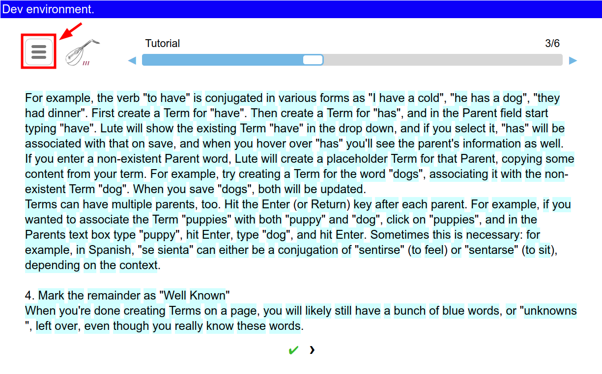
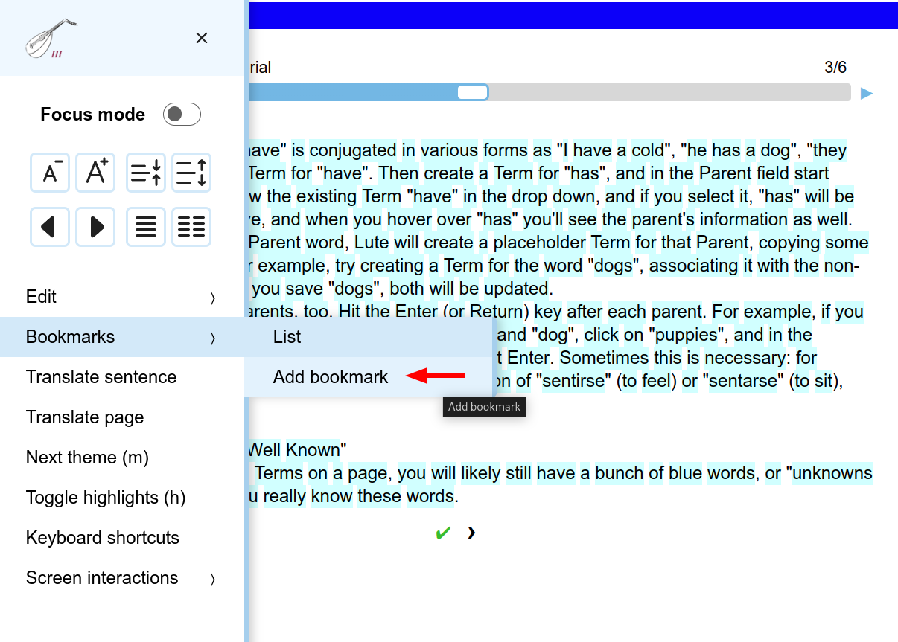
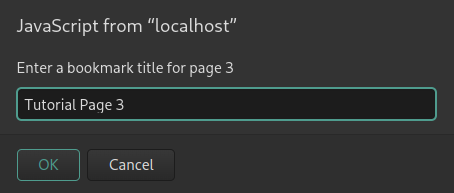
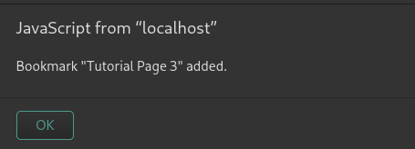
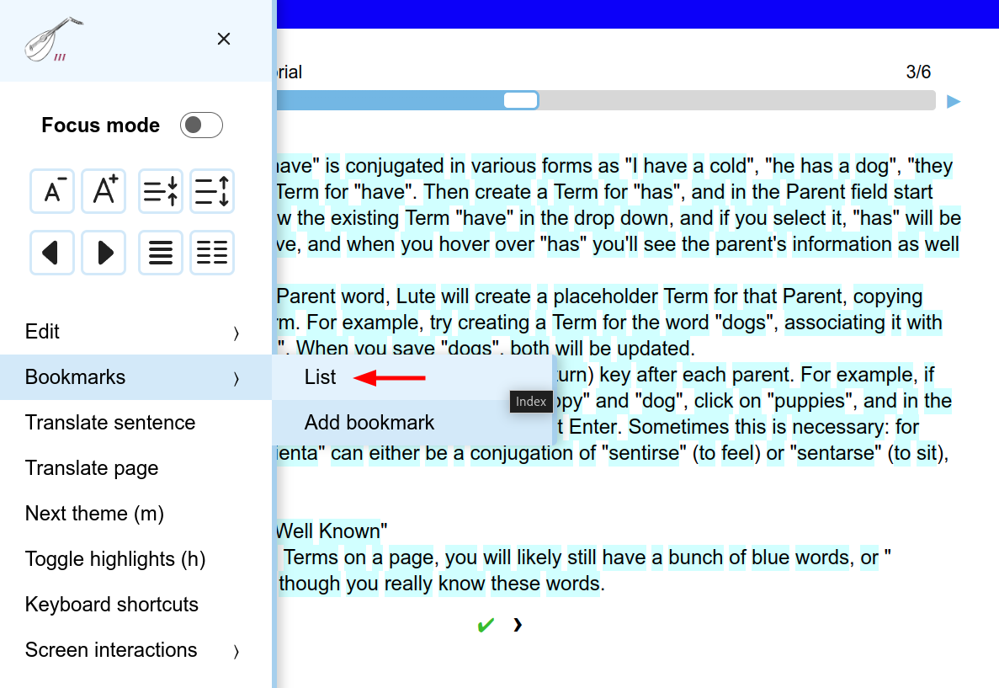
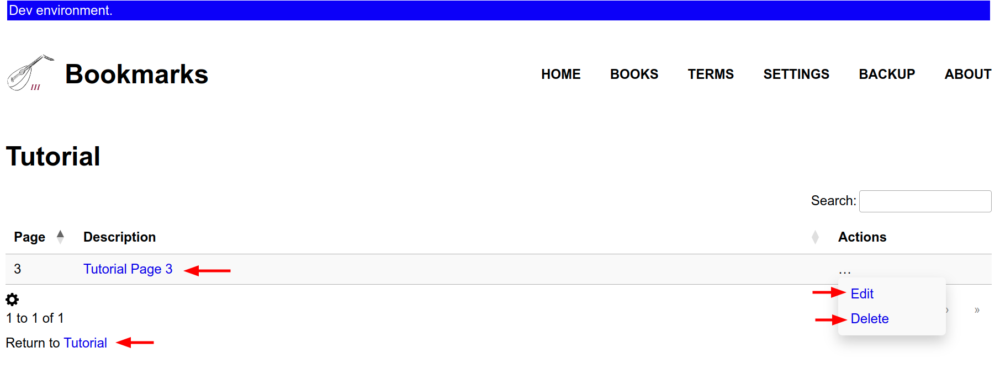

# Bookmarks
Lute allows you to bookmark pages as you read. This can be particularly useful for longer
texts allowing you to mark the locations of book chapters or memorable passages you'd like
to reference later.

## Adding a Bookmark
To bookmark a page, open the hamburger menu in the top left of the reading view while 
the reading view is open to the desired page.

Now select `Bookmarks > Add Bookmark` from the menu.

You will be presented with a popup to provide a name for the new bookmark.
Enter a title and click "OK".

You should receive a confirmation message that your bookmark was successfully created.
Click "OK" again to continue.

## Viewing your Bookmarks
To browse your bookmarks for a particular book, return to the hamburger menu and select
`Bookmarks > List`.

This will take you to a new page where you can review all your bookmarks in a table format.
From this page you have a few options:
- Click any bookmark in the table to navigate directly to that page.
- Return to the book you were just reading via the link at the bottom of the table. 
- Select an option from the Actions menu to modify or delete a bookmark.

