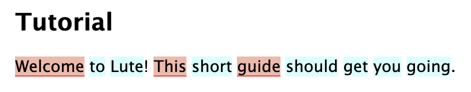

# Bulk editing

> To be released in Lute 3.6.2, currently in beta 3.6.2b1

While reading, you can hold down the Shift key and and click multiple words to act on them.  For example, here I've held Shift while clicking "Welcome", "This", and "guide":

You can hit [hotkeys](bulk-editing.md) to quickly change the status.  For example, after hitting "1" to set the status:

You edit a few more properties using the bulk edit form:

For example, if I wanted to remove any existing parents for these terms, set the parent "newparent", set the status to 3, and tag the terms as "directions", I would enter the following:

Then on clicking Save both terms are updated:

Notes:

* Use the "Remove parents" checkbox to remove any existing parents, without setting any other parents.
* Setting the parent replaces any existing parents.
* You can only set a max of one parent using the bulk edit.  For multiple parents, you'll need to edit each term.
