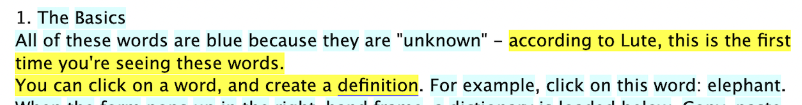

# Copying text

Lute has various things like word clicks, hovers, and keyboard actions for interactions with the text.  Unfortunately, that means that you can't select and copy text from the reading screen in the way that you might normally do.  Here are a few options for copying text:

## Keyboard shortcuts

| Shortcut | Action |
| --- | --- |
| `c` | Copy the sentence of the currently selected word. |
| `shift + c` | Copy the sentence of the currently selected word. |
| `<unassigned>` | Copy the whole page. |

You can configure these shortcuts on via Settings > Keyboard Shortcuts.

When you press the shortcut, Lute highlights the text copied, flashes a "Copied to clipboard!" message, and then you can paste that text.

## Shift-drag to highlight text

If you hold down Shift, click and hold the mouse button, and then drag the mouse across any text, that text is copied to the clipboard when you release the mouse button.  For example:



When you release the mouse button, Lute flashes a "Copied to clipboard!" message, and then you can paste that text:

```
according to Lute, this is the first time you're seeing these words.
You can click on a word, and create a definition
```