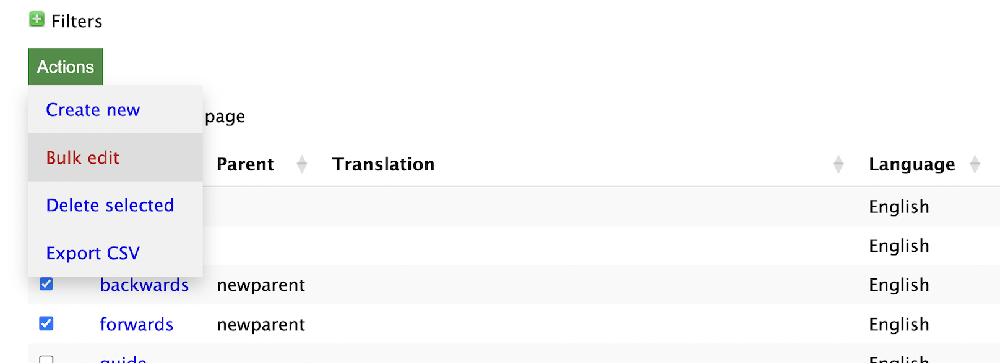

# Bulk editing

> To be released in Lute 3.6.2, currently in beta 3.6.2b1

Terms can be bulk edited from the Terms screen (Home > Terms).  Click the checkbox the Terms you wish to update, perhaps filtering the list first, and then from the Action button choose "Bulk edit":

**Note: all Terms must belong to the same Language!**

For some notes about the form, see [bulk edits while reading](../reading/bulk-editing.md).

In addition to the fields shown in the reading form, you can also downcase selected terms if needed.
