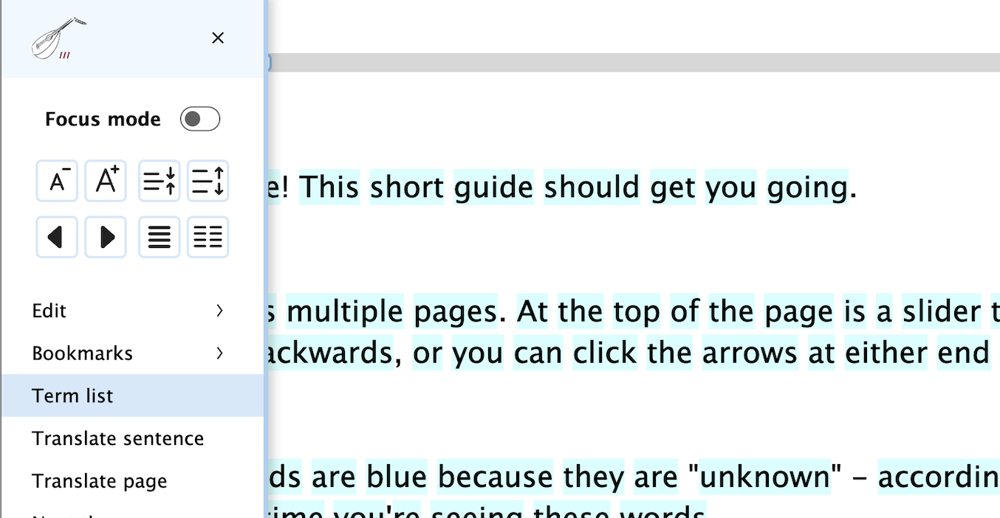
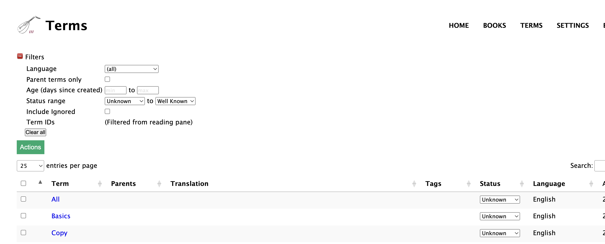
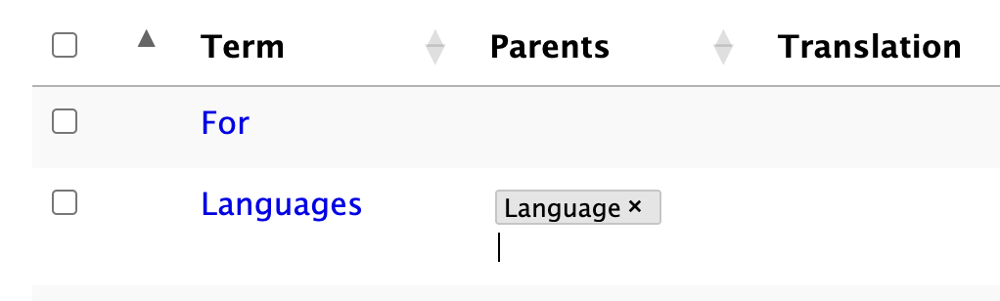

# Editing in the Term list

You can edit a few fields directly in the Term listing screen: Parents, Translation, Tags, and Status.

When reading, click on the "Term list" menu item:

This will open up a Term listing with all of the terms on that page, and any of their parents if you've already assigned them:

You can use the filters at the top of the page to further limit that list as needed.  Then, to update one of the editable fields, just click on it and start editing:

Then **click outside of the field** when done editing so that Lute updates the data.  You'll see a green checkmark when the record is updated.

When you're done your updates, return to the reading screen and refresh it.