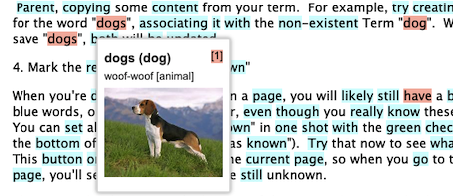
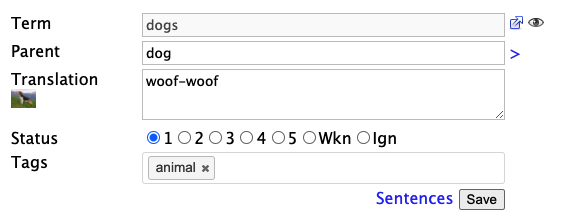

# Parent terms

Lute lets you define "Parent Terms", which is helpful for things like verb infinites, adjectives, etc.  For example, "to have" could be the parent term for "has".  This is useful because you only need to define things like root term meanings at the root level.

Here's the popup for a term with a parent term:

# Setting an existing term as a parent

In the example below, you've already defined the term "have", and you're now creating a new term for "has".  In the "parent term" text box, if you type "ha", Lute then suggests the predefined term "have" as the parent:

# Defining a term and a new parent

> Note the UI has changed slightly since this was written, but the idea is still the same.

In the example below, you're defining the term "dogs", and creating the parent term "dog" at the same time ("dog" wasn't defined previously):

Here's the popup for the "dogs" term:

And for "dog":

Note that the new parent term ("dog") gets the exact same information as the new term ("dogs"):

| term | details |
| --- | --- |
| dogs |  |
| dog |  |

While this might feel counter-intuitive, I've found that it provides the fastest input and term definition for Lute as I'm reading.  If I need, I can go back to the parent term later and clean things up.

# Click a Parent tag to edit the parent Term

When you click on a Term with parents, the parent tags are clickable, so you can quickly move to the parent Term.

For example, I've clicked on the term "existing" to show its form:

If I click on the parent tag "exist", the form moves to that Term:

I can then edit and save that parent term normally.

# Multiple parents

Sometimes, a word might have multiple parents.  For example, in Czech, "hoře" is a declension of "hora", the regular form of "hoře", and a conjugation of "hořet".  In Spanish, "se sienta" could be a conjugation of "sentarse" or "sentirse".  Each parent is entered as a separate tag.  You can add multiple parents by typing them and hitting space or return.
