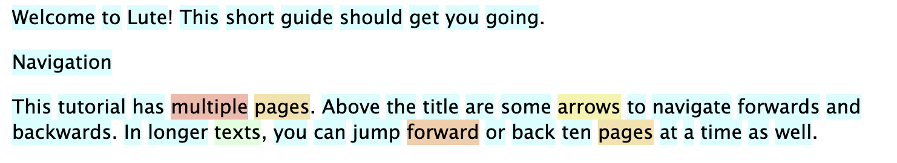
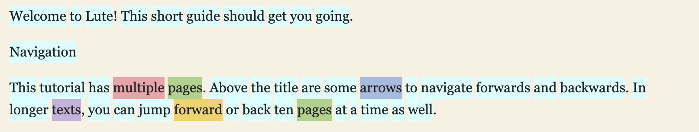
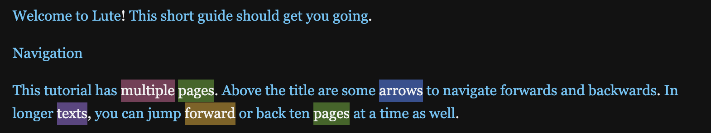
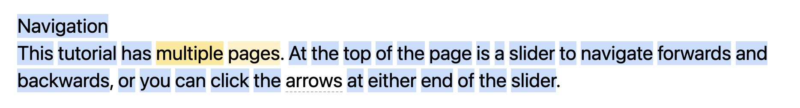
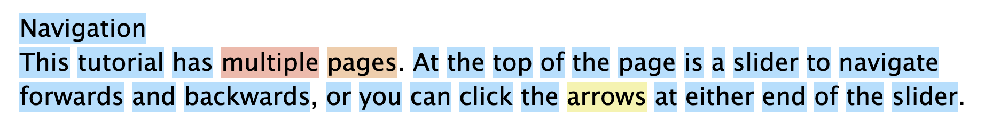

# Themes

You can apply one of the predefined themes in the Settings.  Select the theme from the dropdown.

## Built-in themes

### Default

### Apple Books

### Dark slate

### Night

### LingQ

### LWT

## Custom themes

You can add your own custom themes as .css files in the `userthemes` folder in your data directory (see Home > About).

New files (e.g. "my_theme.css") are added to the theme dropdown list.

You can also tweak the built-in themes by adding a similarly named file to that directory.  E.g., for the "Apple Books" theme, create a file called "Apple_Books.css".  Any styles you add in your personal file are applied _after_ the existing styles in the theme.  The existing themes are in the [GitHub repo](https://github.com/LuteOrg/lute-v3/tree/master/lute/themes/css).

## "Change theme" hotkey - "m"

You can quickly cycle through the themes while reading by hitting the "m" hotkey.  Find what feels best.